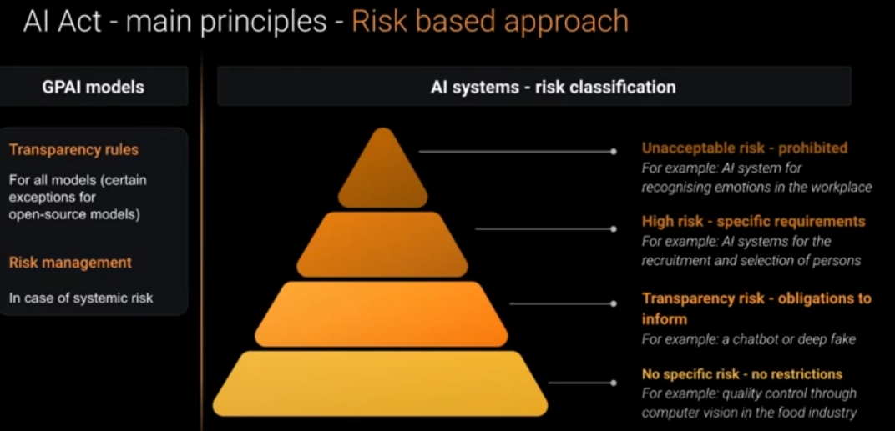
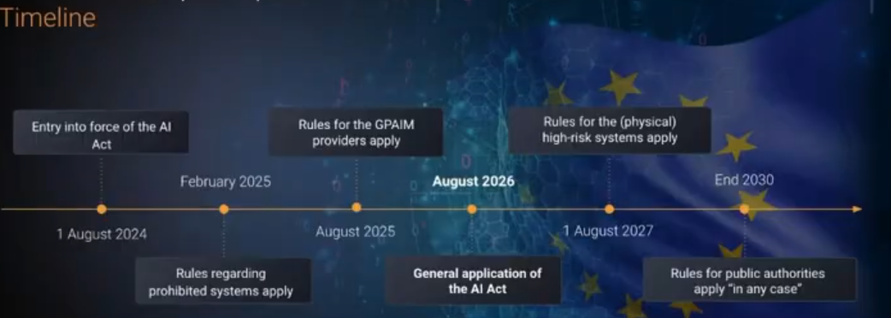
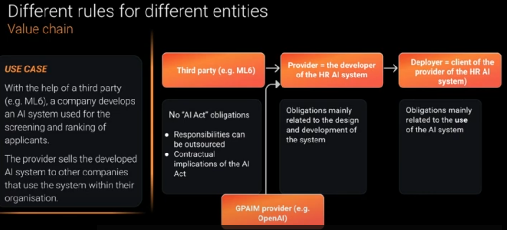
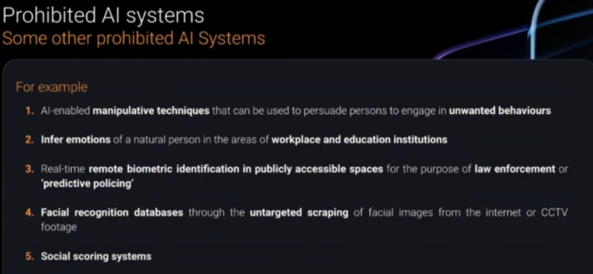
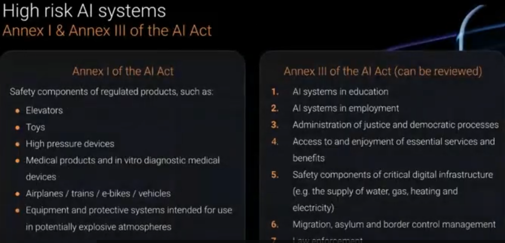
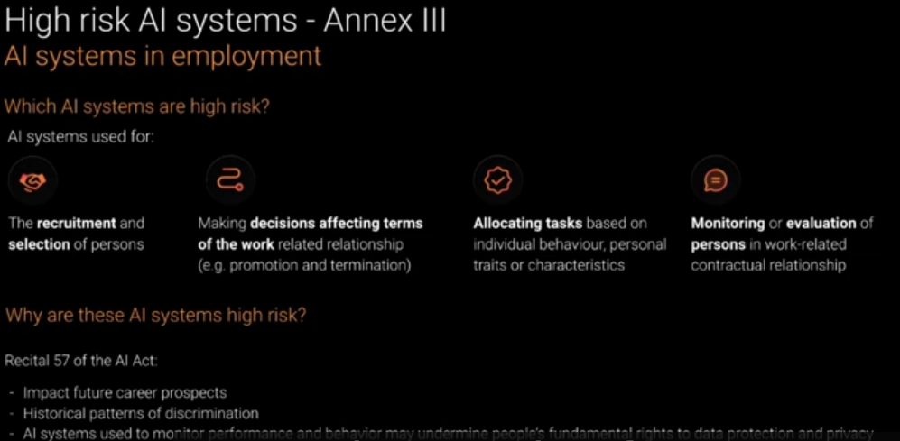
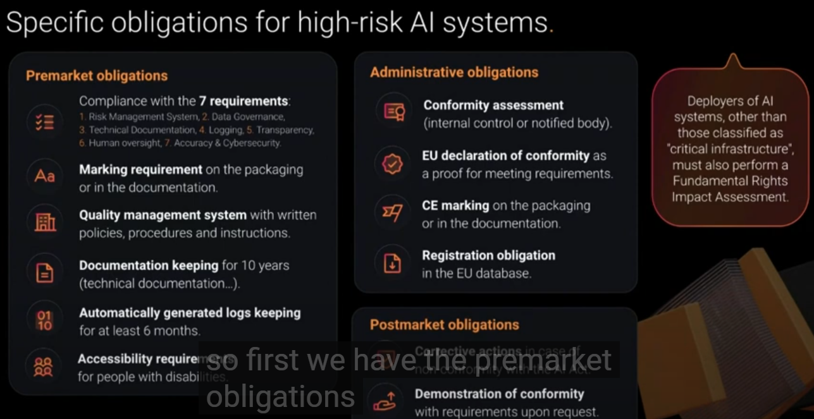
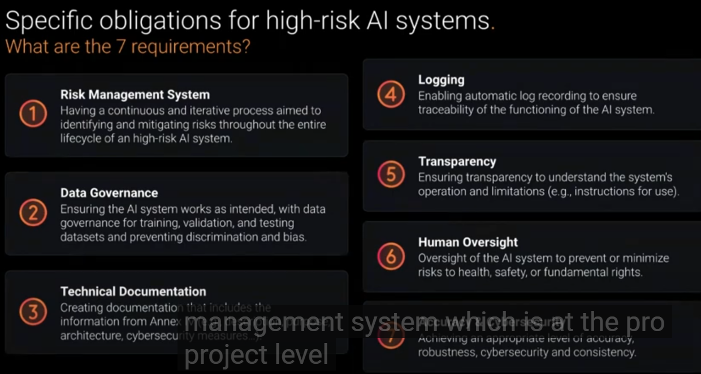
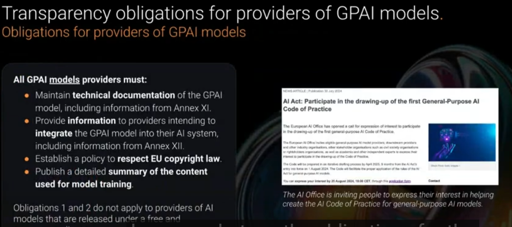

# De AI Act

De inhoud van de les over de AI act is te bekijken in de volgende opname: https://www.youtube.com/watch?v=iGcBiSALCUg.

1. Main principles of the AI Act.
2. Measures to support innovation.
3. The rules will depend on the role of your organization.
4. Certain AI systems will be prohibited by the AI Act.
5. Certain AI systems will be high risk, but not prohibited.
6. Specific obligations/requirements for high-risk AI systems.
7. Transparency obligations for providers of GPAI models (GPAI = General Purpose Models)
8. Transparency obligations for chatbots and GenAI applications.
9. Ensuring AI literacy of your employees will be mandatory.
10. How to prepare for compliance with the AI-Act?

Links naar de officiële tekst van de AI Act:

- https://eur-lex.europa.eu/eli/reg/2024/1689/oj
- https://eur-lex.europa.eu/legal-content/NL/TXT/HTML/?uri=OJ:L_202401689

**Hieronder vind je het transcript van https://youtu.be/iGcBiSALCUg?feature=shared**

In today's AI landscape we can no longer let AI governance to be overlooked. 
AI governance refers to the Frameworks linked to processes which guides legal, ethical and secure AI.

Talking about AI governance, we obviously need to talk about the AI act as well as it plays a central role in the responsible development of AI. Hence our first
webinar all you need to know about the AI act.

This is the agenda of today.
What do you need to know about the AI act .
We will discuss 10 points, including a recap of the main principles.
We will talk about:
- measures to support Innovation,
- the roles of different entities
- prohibited AI systems
- high-risk AI systems
- transparency
- obligations
- a mandatory AI literacy

We will also give you some tips on how to prepare for compliance.

## 1. Recap of some main principles of the AI Act

The purpose of the AI Act is to make sure that AI systems that are put on the market or put into service in the European Union are safe products. Therefore there is a big focus on the
risks that these systems can bring for
- the health,
- safety and
- fundamental rights of individuals.

The AI act thereby follows a uniform approach that we know from other European product regulations such as the regulation for toys, medical devices, ebikes and so forth. In the AI act we
see more or less the same structure and mechanisms. For example the C marking and the marking that we know in the European Union to make sure that a system is compliant. We will have something similar for AI systems. Providers of a high-risk system will also need to have a quality management system. 

The AI act follows a risk-based approach. Systems providing higher risks are met with more compliance obligations. If there's no risk there are also no restrictions. This
is also similar to what we know of other product regulations, example medical devices. A band-aid or a pacemaker for example, they bring different risks, so there's a different regulation for them. AI systems will be regulated in a different manner according to their estimated risks.

There will be different rules for different entities. Thereby the whole life cycle / the value chain of the AI system is regulated.

In the AI act, there's a big focus on mitigating the risks, but there are also measures to support innovation. 

The AI act is imposing a consistent legal framework in the whole European Union with the main enforcement of the rules on the national level. 
We have national competent authorities that can impose fines or penalties if the rules are not met. 

When we talk about the AI act, a graphic that is often displayed is the so-called pyramid. The risk-based approach basically is that 
- certain systems hold  an unacceptable risk. Such a system will be prohibited,
- if it's a high risk it's not prohibited, but specific requirements need to be met,
- certain AI systems pose no risks. Such systems are not restricted.

For example: a smart camera in the food industry checking that packaging meets certain requirements. Such a system can be developed without any restrictions. A lot of AI systems will
actually remain unimpacted. For the other categories, we will give more examples throughout the webinar.

There is the risk classification of the AI systems on the one hand. On the other hand, the general purpose AI models and the providers thereof also
have certain responsibilities. For example: a general purpose AI model is GPT4 by open AI or Llama by Meta. These providers mainly have transparency rules. They have to show how the system works and how it was developed. 

There is a timeline of the application of the AI act.

An important date is August 2026, the general application date of the AI act. 

However, there are a few deviations. For example: 
- the rules regarding prohibited systems. They already apply as of February 2025.
- The mandatory AI literacy is also applicable as of February 2025.
- The rules for the general purpose AI model providers apply as of August 2025.
- There are certain rules that apply later.

For now it's important to know that the general application date is August 2026, with a few deviations.

## 2. The measures to support innovation in the AI act.

The purpose of the AI act can be read in article one.

It is mainly there to protect fundamental rights, to protect our European values. On the other hand, we can read in article one that there is also the goal to support
innovation. We can see that it was the goal to find some sort of balance between making sure that we have safe products on the market and on the other hand that we support
innovation as well, or that we at least do not stiffle innovation. This is also a frequently heard concern on regulating AI, that it would stiffle innovation in this highly dynamic and fast developing interesting area of technology. 

What kind of measures to support innovation do we see in the AI act?

### R&D exemption

The first one is that there's an R&D exemption, so for research and development or for testing and developing an innovative product before it's put in the market, there are certain
exceptions.

### Harmonised standards

Secondly, there will be harmonized standards. These are European standards adopted by standardization organizations for example CC and they basically draft guidance for you to make sure on
how you comply with a system and if you're conform with the harmonized standards then there's also a presumption of compliance. How is this contributing to innovation? It creates more legal certainty: there is a more clear playing field and therefore it also accelerates growth.

### Focus on SMEs and start-ups

Thirdly there is a focus on small-sized and medium-sized enterprises and startups. Certain obligations are a bit less strict for these kind of companies. For example, when you develop a high-risk system you need to draft technical documentation. A small- and medium-sized enterprise can draft it in a simplified manner. The AI act says that the penalties for such companies
should take the economic viability of such a company into account.

### Regulatory sandboxes

The last measure to support innovation is the so-called "regulatory sandboxes". This is a little bit of a fake concept maybe but it's a concept that we know from the fintech industry where after the crash of 2008, there was a lot of regulation, but there was still some ability needed to test new products and therefore the sandboxes were introduced. It's a kind of mechanism, a tool, where a market participant can collaborate with an authority and where innovative systems can be tested under regulatory oversight. So, it is a kind of temporary experimentation space. 

Let me give you an example: a simple approach would be a series of workshops where authorities and market participants work together to brainstorm on novel ideas in certain areas and where
they can work without having the risk of being fined.

## 3. There will be different rules for different entities in the value chain. (The rules will depend on the role of your organization.)

The working of the value chain will be illustrated by using an example of a typical use case.

Use case: There's a company that wants to develop an AI system, an AI-HR tool used for the
screening and ranking of applicants. For the technical work, it has the help of a **third party**. The **provider** then sells the
developed AI system to other companies that use the system within their organization. For the screening and the ranking of the applicants, also a big
AI model is being used. 

How will the AI act obligations interact? 

First of all, the developer that wants to develop the HR-AI system is the provider. 
The organization that wants to use the system and that buys the system from the provider, is the **deployer**. There is also the **general
purpose AI model provider** as the big AI model is used for the screening ranking and potentially summarizing specific use case. 

Here we see that 
- the provider has mainly obligations related to the design and development of the system,
- the deployer mainly has obligations related to the use of the system and to help the provider,
- the general purpose AI model provider has certain transparency obligations for the downstream provider, it should help them with the technical documentation.

The third party helping with the technical development has no legal AI act obligations. On the other hand, the responsibilities of the provider can be contractually outsourced to the
third party. Here we see the contractual implications of the AI Act and the need for clear contracts. The third party is in the best suited position to draft the technical documentation. The provider is legally responsible for it. It is not illogical that that obligation is outsourced. 

In practice, we see that an overlap is possible. For example: the provider developing the system can also use it in its own organization. In that case the provider will also be the deployer, so it will need to meet all the obligations of a provider too.

## 4. Prohibited systems

The AI-Act follows a risk-based approach. The prohibited systems pose an unacceptable risk.

For example: in Hong Kong, a startup developed a system to infer a child's emotions, while learning in school. It could indicate that the student was either sad or happy, frustrated, surprised,...

Such a system will be prohibited in the EU and this already from February 25 onwards. One of the reasons why such a system should be prohibited is that it can only detect primary emotions and
a lot of nuances are being missed, especially when we work with different necessities and different cultures. This means that it can go wrong quite easily. For example, a student can actually be very focused while the AI system would interpret the emotion as being angry or uninterested. Another student can have a loud voice and therefore be very expressive and happy, but the system could classify it as being aggressive. These kind of differences/nuances arealso strengthened by cultural differences. 

What does the law say about this category in the articles of the AI act? 

The law says quite explicitly AI systems used to detect the emotional state of individuals and situations related to the workplace and education are prohibited. 

Why are these systems prohibited? We read in recital 44 for example that there are concerns about the scientific basis. It has limited reliability, there is a lack of specificity, it can easily miss certain nuances, it can lead to discrimination and it's a very intrusive AI system. Also taking into account the imbalance of power in the context of work oreducation in combination with uh the intrusive nature of the system. therefore it's prohibited.

It is only prohibited in the workplace or a situation of work and education. In other situations, it's not prohibited but it's just a high risk system. 
There's another exception: when it is used for medical or safety reasons, the prohibition is lifted. 

An example could be the therapeutical use, for example if the system would be used for autism therapy sessions in schools, helping therapists to tailor certain
interventions, then it could potentially be allowed.

There are other categories of prohibited AI systems, an overview:

All of these systems have in common that they contradict our European values, our values of respect for human dignity, freedom, equality, democracy or rule of law,...

### "manipulative techniques"
An example would be a sort of a social chatbot identifying lonely elderly men, so vulnerable people as well and them into paying for some sort of Premium friendship features with
an AI generated female.

### "predictive policing"

An example: the famous case of the United States Compass tool, an assessment tool of defendants. It was assessing whether or not the defendant is liable to being a recidivist. There, we saw that black people were much higher risk of being at labeled a recidivist than white people. We feel it's a very intrusive system, therefore it should be prohibited.

## 5. The classification of the high-risk AI systems

Here it's interesting to see that the European commission predicted that only 5% to 15% of the AI systems will be considered high risk. 
In practice, we feel that this is more or less the case. Maybe it's a little bit more, mostly because companies can choose the safe option, if their AI system is for example in a gray area, they can choose not to take risks, so they'd classify it as a high-risk use case.

A second observation is that we see that certain sectors are more impacted, for example the public sector.

Remember that not every AI system is high risk. A lot of systems remain unimpacted by the AI Act or at least impacted in a less strict way. 

Remember also that a high-risk AI system is not prohibited. There are certain risks and therefore we have the requirements, so that the risks can be mitigated.

The classification is also formal: whether an AI system is high risk or not depends on its presence or absence in a given list.

The classification of a high-risk use case can be quite tricky and therefore there's also more guidance on its way. We can read in the AI act that no later than February
2026 guidelines shall be provided, specifying practical implications but also giving us a list of practical examples of systems that are high-risk and that are not.

The list of high-risk AI systems has two categories:
- on the left we have regulated products:
    - elevators,
    - toys,
    - medical devices,
    - airplanes,
    - trains,
    - ebikes, ...
    - if the safety component of such a regulated product is an AI systemn then the safety component is also a high-risk use case.

-on the right, there are eight different categories, ranging from 
    - education,
    - to employment,
    - administration of justice,
    - access to and enjoyment of essential services,
    - safety components of critical digital infrastructure,
    - AI systems used for migration asylum and border control management,
    - law enforcement,
    - remote biometric identification in other situations than work or education.

Why are there different categories? 

In the category on the left, there's already a prodct regulation. There is potentially an overlap. 
In the category on the right, it's always important to check whether or not it's a high-risk use case.

Apparently, there is a decision tree helping you to classify the AI system.

To determine whether a system is high-risk, we do the same exercise as for prohibited systems: we
check which system is high-risk in the "AI Act articles" and then we look at the recital to check why these systems are high risk.

Which AI Systems are high risk?

AI systems used for

- the recruitment and selection of persons,
- making descisions affecting term of the work related relationship, for example an AI system that would decide whether or not someone can be promoted or whether or not someone's contract should be terminated,
- allocating tasks based on individual behaviour, personal traits or characteristics
- the monitoring or evaluation of persons in work related cantractual relationship.

Why this is high-risk can be read in recital 57. It can obviously have a very big impact on someone's career, but there might also be historical patterns of discrimination, i.e. the training data could have a lot of bias. We should avoid discrimination and bias and therefore it's a high-risk use case. 

Remark: Some use cases may feel high-risk, but are not high-risk and the other way around.
For example, a use case built at ML6, where they built a public database with legal judgments. To be GDPR-compliant the decisions needed to be anonymous. Therefore, AI was being used. A lot of people would feel this is a hight-risk use case, while if we check the law it's explicitly exempted, it falls into the category of AI systems intended for the administration of justice.

Then what kind of systems are high-risk? Those where it's really an AI system used in court litigation, for example if it would replace a judge, researching and interpreting facts and the law,..., deciding whether claims are founded or not,... 

It is not high risk if it's just for ad administrative activities, for example the analization of judicial decisions.

It can be a tricky exercise to do the high-riskclassification.

## 5. Specific obligations for high-risk systems.

The high-risk AI system are not prohibited. They can be build and developed, but there's an obligation to be compliant with specific obligations.

General observation: The responsibilities that you have as an organization really depends on the role that you have in the value chain.

- The provider is mainly responsible for the development of the AI system.
- The deployer is responsible for the proper use of the AI system.

Notice that most obligations for high-risk AI system fall on the provider. For example, the provider must have a quality management system, must have technical documentation and so on.

There are two big categories of high-risk AI systems:
- we see the one from Annex one, for example a medical device
- and we see the AI system in Annex 3, for example AI tools used for recruitment.

There are slightly different requirements for the two categories.

For example, if you're building a tool for a recruitment, you need to register your AI system in a database. This is not the case for the AI systems in Annex one.

For the AI systems beloning to Annex one, for example medical devices, the deadline is August 2027 and for the other AI systems - in anex 3 - the important deadline is August 2026.

Remark that requirements are not applicable to AI system that that have been already put into service, unless there is a big change. For example you're building an AI tool for
recruitment, which is a high risk AI system and you put that into use before the deadline of August 2026. In that case, you don't need to be compliant with the requirements of the AI act yet. If, after this deadline you change something to your AI system, for example adding new training data or a new feature, then you need to be compliant with the requirements.

So what are the obligations?
We will focus mainly on the obligations for the provider of the high-risk AI system, i.e. so the organization building the AI system.

There are the pre-market obligations:

1. Compliance with the seven requirements:

    1.1. risk management system
    1.2. data governance
    1.3. technical documentation
    1.4. logging
    1.5. transparency
    1.6. human oversight
    1.7. accuracy & cybersecurity

   These are explained more in depth a bit futher.

3. Marking requirement on the packaging or in the documentation: put your name and your contact details on the packaging or in the documentation of your AI system.
4. You need a quality management system with written policies, procedures and instructions. It's an AI governance process that you have in your organization, such as policiy procedures that manage the development of an AI system from the beginning until the end.
5. There needs to be technical documentation and it needs to be kept for at least 10 years.
6. There's a need for automatically genereated logs that need to be kept for at least six months.
7. The AI system should be accessible for people with disabilities.

Once those obligations are fulfilled, the next step is to comply to the administrative obligations:
1. Perform a conformity assessment: it's kind of an audit and it can be done internally. There is a template in the AI Act that can be used. If not internally, it can be done externally.
2. After this assessment, you will receive an "EU Declaration of Conformity" and as a prove for meeting the requirements of the AI act.
3. Put the "CE marking" on the packaging or in the documentation of your AI system.
4. Registration obligation: register the AI system in the EU database.

If for some reason, at some point, a high-risk AI system is not compliant with the AI act, corrective actions need to be taken.
If the authorities are asking for information you need to demonstrate the conformity with the AI Act.

These were the obligations for the provider.

Obligations for the deployer: For certain high-risk AI systems, like for recruitement or education, you need to perform "a fundamental rights impact assessment".
Wyh? Because those high-risk AI systems have a big impact on people's life. Therefore, it's important to have an assessment before putting the service into use. 

What are the seven requirements? 

1. Next to a quality management system (which is more for your organization), you also need a **risk management system** which is at the project level. What you need is a process to identify and mitigate the risk of your AI system. This is not a task that you should do at the beginning and then just forget about it. It's a continuous and iterative process.

2. You should follow **data governance** best practices such as:
- having a training, validation and testing data set and
- making sure that there is no discrimination

3. **Technical documentation** is important and all the information that you need to include in your documentation is captured in Annex 4. For example: the purpose, the architecture,...

4. You need a **logging mechanism** to ensure traceability of your AI system

5. You need to provide **transparency**. For example: by means of instructions for using the system, to make sure that the users understand the limitations of your AI system.
  
6. **Human oversight**: Oversight of the AI system to prevent or minimize risks to health, safety, or fundamental rights. For specific AI systems it's important to have a human in the loop, someone
checking the results before they go live.

7. Accuracy and cyber Securities are very important: achieving an appropirate level of accuracy, ruobusness, cybersecurity and consistency.
   
What does it mean in practice?

Here above is an example. "Tim" actually received a fine because an AI system detects detected him using his phone while driving whereas he was just actually scatching
his head. How can we prevent those kind of unfair penalities by meeting the requirements of the AI act?

There are different things, for example:

- You will have a risk management system so you should spend more time thinking about those kind of risk and what the consequences are.
- Because you're following data governance best practice, you should use a representative data set, so you'd make sure that you have enough pictures of people scratching the heads instead of calling.
- Someone having a human oversight to double checkthe results.
- Ensure transparency to understand the system's operation and limitations,  so that the human in the loop does not overrely on the results of the AI system
- Disposing of technical documentation to know what has been implemented.

## 7. & 8. Transparency: Transparency obligations for providers of GPAI models (GPAI = General Purpose Models), Transparency obligations for chatbots and GenAI applications.

Let's go back in time, when the text for the AI Act was almost ready to be published, generative AI tools like CH GPT and mid Journey just came up and  there were a lot of concerns about the risk
of generative AI, such as deep fake, disinformation, impersonation,...

It has lead to the inclusion of a new chapter chapter "five" about the general purpose AI models, so about generative AI. 

What is generative AI? The law makes the distinction between GPAI models and GPAI systems. 

What is a GPAI model? It's an AI model, for example GPT4, that has been trained on a large amount of data and that can perform a wide range of tasks. 
GPAI: General Purpose AI.

On top of that, there is - what we call - a GPAI system. A GPAI system is an AI system which has been built based on a GP model, so on top of it. For example, let's say you're building a recruitment tool and you need
a summary of the questions asked during the interviews and the answers given. Then you could use a GPAI model, like GPT4, which makes that your AI system that your tool is a GPAI syste.

Obligations for poviders of GPAI models must:

1. maintain **technical documentation** of their model,
2. provide enough **information** to integrate their model into your system,
3. have a **policy to respect EU copyright law** and
4. provide a summary of the training data

Remark that the two first obligations do not apply for open-source GPAI models.

Also remark that the AI office is really looking to companies for drawing up the guidance for the general AI purpose models.

Also note that what we see is that companies like open AI are publishing articles, saying: "Okay we want to be compliant with the AI act, but we still need some guidance because it's a quite recent law." Apparently, they are really committed to do it.

What can you expect?

In theory, you can expect more transparency, for example transparency on which data has been used, but also more reassurance that it respects the the EU copyright law.

Why is transparency so importantfor AI and especially for generative AI?

Let's take an example: Firefly is a generative AI tool that you can use to create or to edit pictures, like: "a dog in a sweater". When Firefly was released by Adobe, they were very transparent and open
about the data they used. The advantage of being so transparent is that it creates more trust from the users. They have all the information they need to trust the product and to decide whether to use it or.

Now, what are the obligations so by August 2026 um if you're building a gen AI-tool? It depends on the kind of AI system that you have.

- If you have an AI system interacting with humans (a typical example is a chatbot), then you need to inform the user that they are interacting with an AI system, for example by means of an disclaimer before the conversation starts.
- If your AI system is generating synthetic content such as audio, image, video and text, you need to make sure that the content is marked as artificially generated

This is  guidance expected from the AI office to know what it means in practice.

If your AI system is being used for generating text, for the specific purpose of informing the public, you need to disclose that the text has been generated - unless it has been reviewed by a human.
For example if you'regenerating text for press articles, but there is no human in the loop, then you need to to say it has been generated by using AI. If there is a human reviewing it, it's not mandatory.

## 9. AI Literacy

As of February 2025, the AI literacy requirement has a large impact on organizations.

Employers have to provide AI trainings to the employees who are using or developing AI tools. 

If employers are reusing an AI system, like for example Copilot, in the organization, or they use an in-house tool, then the complany needs to provide training to it's employees.
It's really important because that makes sure that they understand the opportunities, but also the risk of the technologies and they can make informed decisions.

Remark that there is no specific requirement on the format or on the content of the training. It could be one hour or full day on-site training. With respect to the content, it's important that people know how AI Works, know the risks and the opportunities. 
People need to be aware of the risk before using a certain technology. It depends on their level of knowledge: 
- an AI engineer does not need a beginner course,
- for non-IT people maybe does um some three tips for uh implementing AI literacy in your company

For reaching the AI literacy goals in a company,

- it is important to list all of the AI systems that are being used in the orgainzation,
- define the required skills for using them. For example, if an application is using generative AI, the risk of hallucination should be known to the users,
- evaluate the knowledge of the employees and based on that, define training groups,
- plan theoretical and practical training sessions.

##  10.How to prepare for compliance with the AI-Act?

To prepare for compliance with the AI act, a company can start today:

1. be aware of the AI act and its implication in your organizationn
2. list the AI systems used in the organization, for example licences like co-pilot and others,
3. classify those AI systems,
4. define the role of your organization in the value chain (provider, deployer, both, other?)
5. develop a compliance strategy.