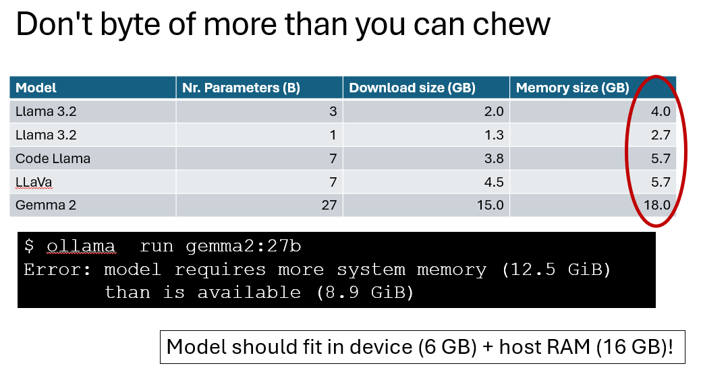

# AI for researchers

Hier zijn een aantal sites die tools aanbieden voor researchers, bv. om papers te raadplegen of om dingen samen te vatten.

Indien je ze gebruikt, lees waarvoor ze geschikt / niet geschikt zijn, ben je bewust van eventuele data die je deelt.

Ik heb ze zelf nog niet grondig verkend, maar wou het toch meegeven.

Onderaan zijn libraries die je kan gebruiken om (kleine :) ) large language models lokaal te draaien.

## Tools for researchers

- https://scispace.com/, redirected to https://typeset.io/

- https://elicit.com/: "Automate time-consuming research tasks like summarizing papers, extracting data, and synthesizing your findings."

- https://easywithai.com/ai-research-tools/lumina-chat/: "Lumina Chat is an AI-powered search engine that lets you instantly get detailed a- nswers from over 1 million journal articles and research papers. It allows researchers to find insights at lightning speed by skimming full-text sources, analyzing findings, and then validating with interactive citations – essentially providing a ChatGPT-like experience tailored for the scientific community. The tool also has the ability to search your own files and papers using Lumina’s 100GB personal storage."

- https://jenni.ai/: meer om je te helpen schrijven, structureren. 

- https://www.genei.io/

- Perplexity

- Google scholar: https://scholar.google.com/

- Arxiv.org: research papers

## Google notebook LM

https://notebooklm.google.com/?authuser=1

"NotebookLM gives you a personalized AI collaborator that helps you do your best thinking. After uploading your documents, NotebookLM becomes an instant expert in those sources so you can read, take notes, and collaborate with it to refine and organize your ideas."

Hier kan je papers in uploaden, je kan er een podcast mee maken.

Ze gebruiken je data niet om op te trainen, zeggen ze, ref. https://support.google.com/notebooklm/answer/14275965?hl=en&ref_topic=14775295&sjid=14742480410722518857-EU

## Running LLMs locally

- ollama: https://ollama.com/
- lmstudio: https://lmstudio.ai/
- gpt4all: https://www.nomic.ai/gpt4all

 
