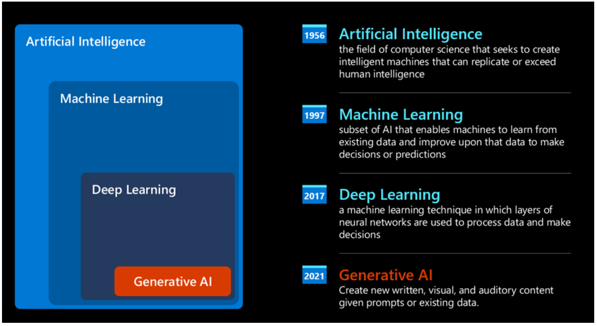
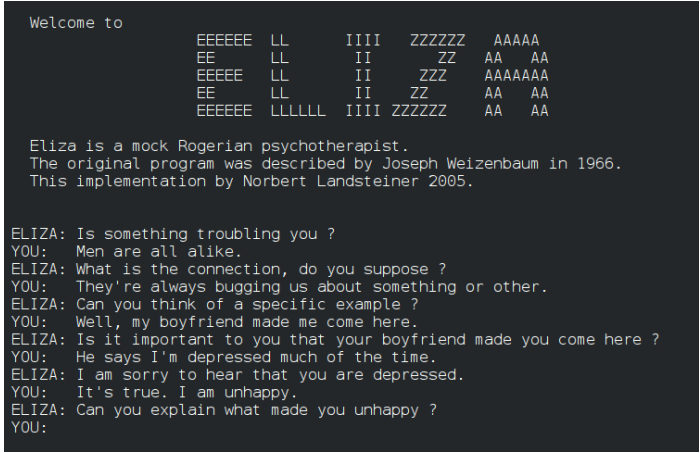
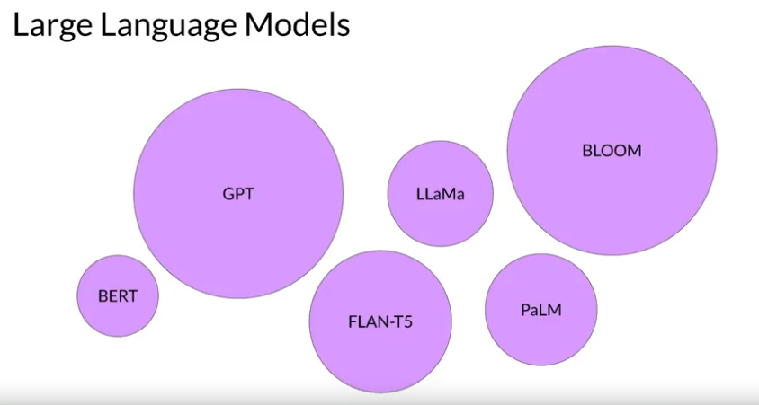
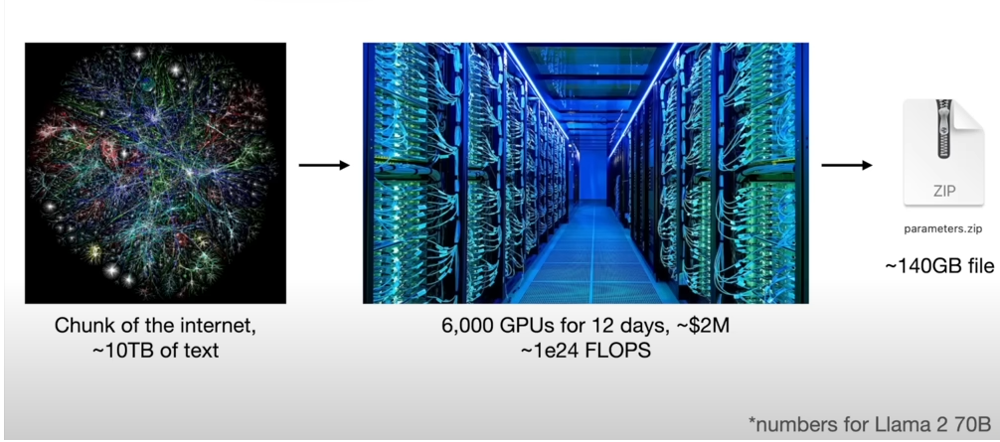

# Inleiding
In dit vak gaan we kijken naar recente ontwikkelingen op vlak van AI.
We focussen op dé hype van het moment: generative AI.
Daarnaast komen enkele andere actuele onderwerpen aan bod, zoals de "AI Act" en de interpreteerbaarheid (Explainability / Interpretability) van een model, alsook en ethiek & bias.

## Onderwerpen:
- prompt engineering
- embeddings
- vector databases
- RAG and finetuning
- langchain
- AI act
- Explainability: shapley values, saliency mapping, lime
- Adversarial AI
- ...

## Evaluatie
100% schriftelijk examen (1e en 2e zit) (virtuele campus: 100% mondeling exampen)

## Present day, genearative AI
How did we came to Generative AI?

Ondanks de hype die recent gecreëerd werd door de komst van "generative AI models", is deze technology reeds decenia in de maak, met de eerste onderzoeksinspanningen die dateren van in de jaren '60.
### Knowledge base - rule based AI ('50 - '60)
De eerste prototypes van kunstmatige intelligentie ("artificial intelligence") bestonden uit "typewritten chatbots". Deze waren opgebouwd vanuit de gedocumenteerde kennis van een group van experten (een "knowledge base"). Deze kennis werd gerepresenteerd in een computer.
De antwoorden in deze "typewritten chatbots" werden geactiveerd door trefwoorden die in de input tekst voorkwamen. Al snel werd duidelijk dat een dergelijke aanpak niet goed schaalde.

De eerste chatbot, ELIZA, werd in 1966 ontwikkeld door Joseph Weizenbaum in het Artificial Intelligence-lab van het Massachusetts Institute of Technology (MIT). Vergeleken met de huidige chatbots gebruikt ELIZA vooraf bepaalde reacties op basis van een trefwoord. Als zodanig kan het niet echt een gesprek als een mens voeren.

(Hier is een mooi verhaal over de evolutie van chatbots:
https://techacute.com/whats-the-first-chatbot-and-how-old-are-chatbots/)

### Machine learning: a statistical approach to AI ('90)
Een keerpunt kwam in de jaren '90, met de toepassing van een statistische benadering van tekstanalyse. Dit leidde tot de ontwikkeling van nieuwe algoritmen, bekend onder de naam "machine learning", die in staat zijn patronen uit gegevens te leren zonder expliciet geprogrammeerd te zijn.
Deze benadering stelt een machine in staat om menselijk taalbegrip te simuleren.
Een statistisch model wordt getraind op tekst-label combinaties, waardoor het model onbekende input tekst kan classificeren met een vooraf gedefinieerd label dat de intentie van het bericht vertegenwoordigt. Op tekstueel vlak spreken we van NLP, 'natural language processing'.

### Neurale netwerken en moderne virtuele assistanten (+-2010)
Recenter, heeft de technologische evolutie van de hardware - het is nu mogelijk om grotere hoeveelheden data te verwerken en om meer complexe berekeningen uit te voeren - onderzoek in vershillende domeinen van de artificiële intelligentie gestimuleerd. Dit heeft geleid to de ontwikkeling van meer geavanceerde machine learning algoritmen: neurale netwerken of deep learning algoritmen.

Neurale netwerken (in het bijzonder Recurrent Neural Networks - RNNs) hebben de verwerking van natuurlijke taal aanzienlijk verbeterd. Zij maken het mogelijk om tekst als het ware, te interpreteren. Om de betekenis van een woord in te schatten, word de context van de zin waarin het voorkomt, in rekening gebracht.

Dit is de technologie die de virtuele assistenen uit het eerste decenia van de nieuwe eeuw ondersteunden. Deze is zeer bedreven in het interpreteren van de menselijke taal, het identificeren van een behoefte en het uitvoeren van een actie om daaraan te voldoen. Bv. het antwoorden op een vraag op basis van een vooraf gedefinieerd script.

### Generative AI (today)
Zo kwamen we tot de "generative AI" van vandaag. Deze kan worden gezien als een subset van deep learning. Na decennia van onderzoek op het gebied van AI overwon een nieuwe modelarchitectuur – genaamd Transformer – de beperkingen van RNNs, omdat het in staat is om veel langere tekstreeksen als invoer te verwerken. Transformers zijn gebaseerd op het attentiemechanisme, waarbij meer 'aandacht' wordt besteed aan waar de meest relevante informatie in een tekst.

De meeste recente "generative AI" modellen zijn gebaseerd op deze architectuur. Deze zijn ook bekend als Large Language Models (LLMs), omdat ze werken met tekstuele invoer en uitvoer.
Deze "large language" modellen zijn getraind op een enorme hoeveelheid niet-gelabelde data uit diverse bronnen zoals boeken, artikelen en website. Ze kunnen worden aangepast aan een breed scala aan taken. Zo kunnen ze bv. grammaticaal correcte tekst genereren met een schijn van creativiteit. Ze hebben niet alleen de capaciteit van een machine om invoertekst te 'begrijpen' enorm verbeterd, maar ze hebben ook de mogelijkheid gecreëerd om een originele respons in menselijke taal te genereren.

## generative AI, meer dan enkel tekst generatie
Alhoewel we ons in deze cursus hoofdzakelijk focussen op tekst genererende modellen zijn er ook veel andere toepassingen van generatieve AI.

- genereren van beelden (images, logo's,...),
- genereren van video,
- genereren van audio fragmenten

Een voorbeeld, gebruik makend van de 'image' generator van ChatGPT.
Vraag:
"Design a logo for a new course, called: "Trends in AI". Topics of the course are: generative AI, the AI act, interpretability, ethics."
Resultaat:

## model inference vs model training
 We spreken over:
- "model inference", d.i. het gebruik van het model => draait op een computer
- "model training", d.i. het leren van de parameters => dit is computationeel intensief.

De machine learning-modellen die generatieve AI ondersteunen, hebben deze vaardigheden geleerd door statistische patronen te vinden in enorme datasets met content die oorspronkelijk door mensen is gegenereerd. Grote taalmodellen zijn getraind op triljoenen woorden gedurende vele weken en maanden, en met veel rekenkracht. Deze foundation modellen, zoals we ze noemen, met miljarden parameters, vertonen eigenschappen die verder gaan dan alleen taal. Onderzoekers ontdekken hun vermogen om complexe taken te ontleden en problemen op te lossen.

Hier is een verzameling foundation modellen, soms ook basis modellen genoemd, en hun relatieve grootte in termen van parameters. Je zult later (eerder in het vak Deep Learning) in meer detail ingaan op deze parameters, maar je kan ze voorstellen als het geheugen van het model. Hoe meer parameters een model heeft, hoe meer geheugen, en zoals blijkt, hoe geavanceerder de taken die het kan uitvoeren. 
Stel dat we de LLMs voorstellen a.d.h.v. cirkels. Hier is een idee van het aantal parameters waarmee verschillende modellen getraind zijn:
- GPT3: 175 miljard
- BLOOM: 176 miljard
- LLama2: 70 miljard

### voorbeeld
Hieronder is een voorbeeld om een gevoel te krijgen over wat het betekent in termen van resources om een model te trainen, dan wel een getraind model te gebruiken.

Om een 70b-large language model te draaien, heb je in principe 2 files nodig: 
- Een 140GB file die de model parameters bevat,
- Een file met +-500 lijnen code (for example C-code, or python code)

Nota: 70b staat voor "70 billion" of 70 miljard parameters. Voor elke parameter heb je 2 bytes nodig - er wordt gebruik gemaakt van "float16" data - dus de file wordt 140 GB groot.\
De code file dient om het language model te draaien, gebruik makend van de parameters. Dus, om gebruik te maken vaneen model, heb je in principe geen internet connectie nodig. Het draait op een (krachtige) computer.\
Je beschouwt de code file, compileert het, er wordt een binary file gemaakt die je naar de parameters kan laten verwijzen en je kan met dit "language model" praten.
Het "language model" gaat tekst genereren, het zal je instructies opvolgen.

Er is dus niet heel veel nodig om een model te gebruiken. De rekenkundige complexiteit komt erbij wanneer je die parameters wil bekomen, dus wanneer je het model traint. \
Wanneer je de parameters wilt leren, neem je "een deel van het internet" (om het concreet te maken, neem ongeveer 10 TB aan tekst). Om zo een hoeveelheid aan data te verwerken en de parameters van het neuraal netwerk te
leren, heb je ongeveer 6000 GPU's nodig, gedurende 12 dagen. De kost hiervoor wordt geschat op 2 miljoen dollar.

## Het model trainen
Twee belangrijke fasen in het trainen van een LLM zijn:
- het pre-trainen,
- het finetunen.

### LLM: trainingsfase 1 - het pre-trainen
Erg gesimplificeerd voorgesteld is het objectief van een LLM om het volgende woord in een zin/tekst te voorspellen.

Neem bijvoorbeeld de trainingszin “De lector sprak zijn _ aan”. Als in de oorspronkelijke tekst stond ‘student’, zal het model zijn gewichten zien versterken als hij student voorspelt.

Maar natuurlijk, de eerste L van LLM’s, de “Large”, maakt dat we uit zoveel data trainen dat voor vele zinnen er meerdere mogelijkheden zijn. Er is niet langer één juist antwoord, in het voorbeeld zou naast “student” ook “collega”, “opleidingshoofd”, “vriendin”, … een mogelijkheid kunnen zijn.
Dus bij het leren van de gewichten zullen we (conceptueel) een kans toewijzen aan elk van deze mogelijkheden, en dan zou ons model in een ideaal geval bijvoorbeeld 40% van de tijd student voorspellen, 20% van de tijd collega, 5% van de tijd vriendin enz.

Om een LLM dan langere teksten te laten genereren wordt de output na het genereren van een woord gebruikt als input voor de volgende voorspelling.

“De”  
“De lector”  
“De lector sprak”  

Het eindresultaat is een LLM die verbazend vlotte teksten kan genereren.
Dit pre-trained LLM noemen we een foundation model.

Hieronder wordt de pre-training fase schematisch voorgesteld:

Er wordt heel veel ongestructureerde data verzameld (teksten), bv. van internet. De kwaliteit van deze data laat echter te wensen over. Er blijkt dat slechts 1 tot 3% van de origineel verzamelde data bruikbaar is om van te leren (dus om het model op te trainen). Toch blijft dit nog een enorme hoeveelheid data. Met deze data wordt de pre-training gedaan, en er wordt een foundation model gecreëerd. Dit foundation model beschikt dan over een heel pak kennis, in de vorm van een 'vocabulair'. Voor deze pre-trainingsfase is heel veel rekenkracht (GPU) en tijd nodig.

In de pretrainingsfase spreken worden technieken als unsupervised learning en self-supervised learning gebruikt. Er komt geen menselijke feedback aan te pas.

### LLM: trainingsfase 2 - het finetunen
Maar, de teksten die het model genereert, zijn zeer afhankelijk van het soort tekst dat de trainingsdata vormde. Na het trainen van een foundation model, 'weet' dit model al veel, maar het is nog niet goed in het uitvoeren van specifieke taken, zoals bv. het samenvatten van tekst of het antwoorden op vragen. 
Als er veel vooroordelen in de oorspronkelijke tekst zaten, zullen die met een grote kans als ‘waarschijnlijk vervolg’ gekozen worden, en zal het large language model zonder veel moeite de meeste grove uitspraken maken.

Dus, er is een extra stap nodig: het model moet gefinetuned worden. Het model wordt opnieuw getraind met extra informatie. Men maakt datasets waarin het gewenste gedrag gereflecteerd wordt, en gebruikt die om het model verder op te trainen. HIerbij wordt ook gebruik gemaakt van menselijke feedback.

Deze extra informatie die gebruikt wordt voor finetuning is niet zo heel groot in volume (bv. 100000 vragen en bijhorende antwoorden), maar wel zeer kwalitatief voor de taak waarvoor men de LLM uiteindelijk wil gebruiken.

## Hoe werken large language modellen?
Je kan het trainen van het model, dus het creëren van de parameter file vergelijken met het creëren van een zip file (een gecomprimeerde data file).
Data wordt gecomprimeerd. Een belangrijk verschil is dat een zip file zorgt voor een compressie zonder verlies. Wanneer de zipfile uitgepakt wordt, staat de originele data er terug. De creatie van de parameter file is echter een compressie waar "verlies" op zit. Het neurale net leert heel veel, maar reproduceert niet exact wat het gezien heeft. 

#### tokenizer, text to numbers
Eens het model getraind is, is het gebruik ervan vrij eenvoudig. Wanneer er een opdracht gegeven wordt, wordt tekst gegenereerd.

Een 'key' concept wanneer je het mechanisme van een LLM wil begrijpen, is 'Tokenization'. 

Een LLM neemt tekst als input en het produceert tekst als output. Maar, computers werken met getallen, niet met tekst. Dus, de tekst moet omgezet worden in iets numeriek. Dat is de reden waarom elke invoer naar het model wordt verwerkt door een tokenizer, voordat het door het 'foundation model' wordt gebruikt. 

Een token is een stuk tekst dat uit een variabel aantal karakters bestaat. De hoofdtaak van de tokenizer is het splitsen van de invoer in een reeks tokens. Vervolgens wordt elk token gekoppeld aan een tokenindex, wat de numerieke representatie is van het oorspronkelijke tekstdeel.

Een voorbeeld:

Je kan er zelf mee experimenteren op: https://platform.openai.com/tokenizer

#### predicting output tokens
Gegeven een reeks van tokens als input, dan voorspelt het model het volgdende token. Dit wordt dan weer als input gebruikt om het daaropvolgende token te voorspellen.

#### selection process, probability distribution
Het uitvoertoken wordt door het model gekozen op basis van de kans dat het voorkomt na de huidige tokenreeks. Dit komt omdat het model een probabiliteitsdistributie genereert over alle mogelijke volgende tokens, berekend op basis van zijn training data. 

Echter, niet altijd wordt het token met de hoogste waarschijnlijkheid gekozen uit de resulterende verdeling. Er wordt een zekere mate van willekeur aan deze keuze toegevoegd, zodat het model zich op een niet-deterministische manier gedraagt — we krijgen niet exact dezelfde output voor dezelfde input. Deze mate van willekeur wordt toegevoegd om het proces van creatief denken te simuleren en kan worden aangepast met een modelparameter genaamd temperatuur.

Wanneer je een model gebruikt, kan je de temperatuur instellen. Afhankelijk van het model dat je gebruikt, is dat een waarde tussen 0 en 1 of tussen 0 en 2. Hoe hoger de temperatuur, hoe creatiever de antwoorden zullen zijn. Wanneer je een temperatuur van 0 instelt, vraag je het model om zo deterministisch mogelijk te zijn. Maar, zelfs bij een temperatuur van 0 kan je nog verschillende antwoorden krijgen voor eenzelfde input. 

## Het model gebruiken
### prompt, context window, completion
De manier waarop je met taalmodellen communiceert, is heel anders dan andere machine learning- en programmeerparadigma's. In die gevallen schrijf je computercode met een geformaliseerde syntaxis om te communiceren met libraries en API's. In tegenstelling daarmee kunnen grote taalmodellen natuurlijke taal of door mensen geschreven instructies gebruiken en taken uitvoeren zoals een mens dat zou doen. De tekst die je aan een LLM geeft, staat bekend als een prompt. De ruimte of het geheugen dat beschikbaar is voor de prompt wordt de 'context window' genoemd, en dit is doorgaans groot genoeg voor enkele duizenden woorden, maar verschilt van model tot model.

Stel bijvoorbeeld de vraag: 'Waar bevindt Ganymedes zich in het zonnestelsel.?' Deze vraag/prompt wordt aan het model doorgegeven, het model voorspelt vervolgens de volgende woorden, en omdat je prompt een vraag bevatte, genereert dit model een antwoord. De uitvoer van het model wordt een completion genoemd.

Hier is voorbeeld van de grootte van context windows voor een aantal modellen:

## prompt engineering
Vaak zijn er situaties waarin het model niet meteen het gewenste resultaat levert. Je zult mogelijk de taal in je prompt of de manier waarop het geschreven is, verschillende keren moeten aanpassen om het model te laten doen wat je wilt. Dit werk om de prompt te ontwikkelen en verbeteren, wordt prompt engineering genoemd.

We zullen hier verder uitgebreid op ingaan.

## RAG, finetuning and agents
Ontwikkelaars hebben ontdekt dat naarmate de schaal van foundation modellen groeit van honderden miljoenen parameters tot miljarden, zelfs honderden miljarden, ook het subjectieve begrip van taal dat een model bezit toeneemt. Dit taalbegrip, opgeslagen in de parameters van het model, is wat processen, redeneren en uiteindelijk de taken die je het geeft oplost. Maar het is ook waar dat kleinere modellen kunnen worden gefinetuned om goed te presteren op specifieke gerichte taken.

Er zijn vershillende manieren om extra informatie aan modellen toe te voegen:
- RAG of Retrieval Augmented Generation,
- finetuning,

Soms zal het nodig blijken het LLM te connecteren met externe applicaties om het bepaalde taken goed te laten uitvoeren. Deze externa applicaties noemen we 'agents'.

## Pricing
De training van generatieve modellen brengt heel veel kosten met zich mee.
De meeste providers bieden wel een gratis optie om het model te leren kennen, maar deze is veelal heel beperkt.

De pricing wordt berekend a.d.h.v. het aantal tokens in de prompt in combinatie met het aantal tokens in de output.

Een voorbeeld:
https://openai.com/api/pricing/

## verschillende manieren om de modellen te gebruiken.
- web interface, bv. https://chatgpt.com/, https://claude.ai/
- API key
- lokaal, bv. check GPT4All

## terminology of te onthouden
| term                  | beschrijving                                                       | 
|:-----------------|:----------------------------------------------------------------| 
| training              | het leren van de parameters                                        | 
| inference             | het gebruik van het model, het genereren van tekst 
| prompt                | de input tekst die je aan het model meegeeft
| completion            | de output die je krijgt, de gegenereerde tekst                     | 
| context window        | de hoeveelheid tekst of geheugen die beschikbaar is voor de prompt | 
| prompt engineering    | het werk dat je doet om de prompt te ontwikkelen / te verbeteren   |

## Referenties

- Github repository: https://github.com/Pieter-hogent/2324-trendsinai
- Cursus: "generative-ai-with-llms", www.coursera.org
- Cursus: "generative ai for beginners", https://microsoft.github.io/generative-ai-for-beginners/#/
- deeplearning.ai - short courses
- youtube: "Intro to large language models, Anrej Karpathy" -https://www.youtube.com/watch?v=zjkBMFhNj_g&t=1738s

