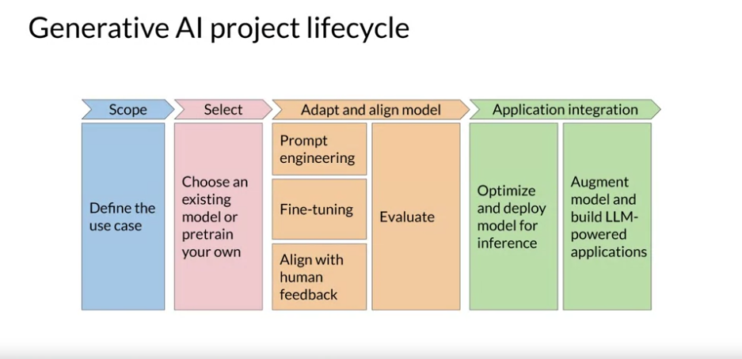

# Generative AI project lifecycle
In deze cursus ga je de technieken leren kennen die nodig zijn om een applicatie te ontwikkelen en te implementeren die wordt aangedreven door een LLM (Large Language Model). Een overzicht van de levenscyclus van een generatief AI-project je kan helpen bij dit werk.

Dit framework schetst de taken die nodig zijn om je project van conceptie tot lancering te brengen. Je leert over de beslissingen die je moet nemen, de mogelijke moeilijkheden die je tegen zult komen, en de infrastructuur die je nodig hebt om je applicatie te ontwikkelen en te implementeren. Hier is een diagram van de algemene levenscyclus. We zullen dit stap voor stap bespreken. 

## Scope
De belangrijkste stap in elk project is om de scope zo nauwkeurig en specifiek mogelijk te definiëren. LLM's zijn in staat om veel taken uit te voeren, maar hun mogelijkheden hangen sterk af van de grootte en architectuur van het model. Je moet nadenken over welke functie de LLM zal hebben in jouw specifieke applicatie. Heb je het model nodig om veel verschillende taken uit te voeren, inclusief lange tekstgeneratie of met een hoge mate van capaciteit, of is de taak veel specifieker, zoals named entity recognition, zodat je model alleen goed hoeft te zijn in één ding? 

Het echt specifiek zijn over wat je nodig hebt dat je model doet, kan je tijd besparen en misschien nog belangrijker, de computerkosten verminderen.

links: \
https://platform.openai.com/docs/models \
https://huggingface.co/docs/hub/model-cards \
https://github.com/cheahjs/free-llm-api-resources

## Select
Zodra je tevreden bent en je de modelvereisten genoeg hebt afgebakend om te beginnen met ontwikkelen, is je eerste beslissing of je je eigen model vanaf nul wilt trainen of met een bestaand basismodel wilt werken. Over het algemeen begin je met een bestaand model, hoewel er enkele gevallen zijn waarin je het nodig kunt vinden om een model vanaf nul te trainen.

## Adapt and align model
Met je model in handen is de volgende stap om de prestaties te beoordelen en indien nodig extra training uit te voeren voor jouw applicatie. Prompt engineering kan soms voldoende zijn om je model goed te laten presteren, dus je zult waarschijnlijk beginnen met in-context learning, met voorbeelden die passen bij je taak en use case. 

Er zijn echter nog steeds gevallen waarin het model misschien niet zo goed presteert als je nodig hebt, zelfs niet met één of een paar korte inferenties, en in dat geval kun je proberen je model te fine-tunen.

Naarmate modellen capabeler worden, wordt het steeds belangrijker om ervoor te zorgen dat ze zich goed gedragen en op een manier die in lijn is met menselijke voorkeuren bij implementatie. Hiervoor gebruiken we een extra fine-tuning techniek genaamd 'reinforcement learning met menselijke feedback' (RLHF), die kan helpen om ervoor te zorgen dat je model zich goed gedraagt.

Een belangrijk aspect van al deze technieken is evaluatie. Er worden metrics en benchmarks gecreëerd die kunnen worden gebruikt om te bepalen hoe goed je model presteert of hoe goed het is afgestemd op jouw voorkeuren. 

Deze aanpassings- en afstemmingsfase (adapt & align phase) van app-ontwikkeling kan zeer iteratief zijn. Je kunt beginnen met het proberen van prompt engineering en het evalueren van de outputs, daarna fine-tuning gebruiken om de prestaties te verbeteren en vervolgens prompt engineering nog een keer herzien en evalueren om de prestaties te krijgen die je nodig hebt. 

## Application integration
Wanneer je een model hebt dat voldoet aan je prestatiebehoeften én goed is afgestemd, kun je het implementeren in je infrastructuur en integreren met je applicatie. In dit stadium is een belangrijke stap om je model te optimaliseren voor implementatie. Dit kan ervoor zorgen dat je het gebruik van je computer resoources optimaliseert en de best mogelijke ervaring biedt voor de gebruikers van je applicatie.

De laatste stap is om eventuele extra infrastructuur te overwegen die je applicatie nodig heeft om goed te functioneren. Er zijn enkele fundamentele beperkingen van LLM's die moeilijk te overwinnen zijn door alleen training, zoals hun neiging om informatie uit te vinden wanneer ze een antwoord niet weten, of hun beperkte vermogen om complexe redeneringen en wiskunde uit te voeren.

