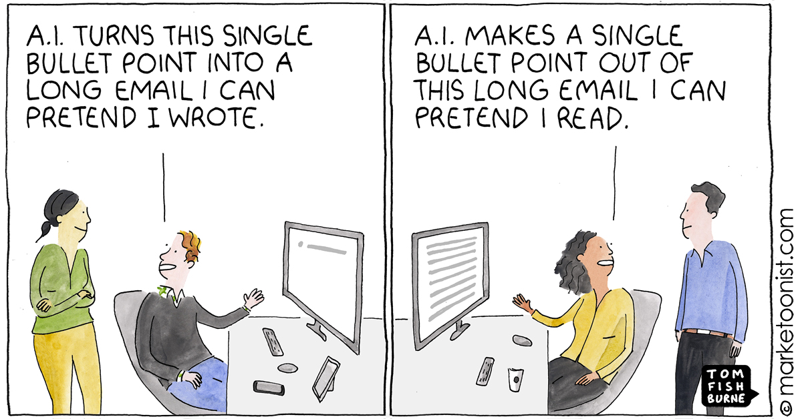
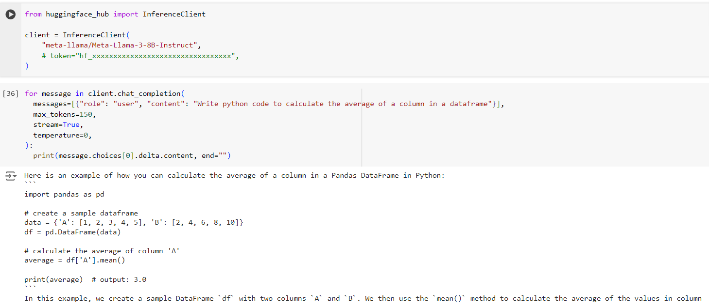
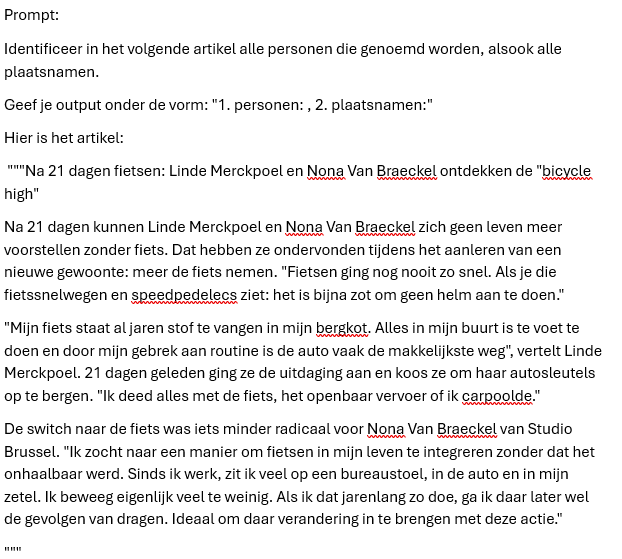
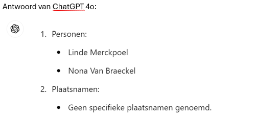
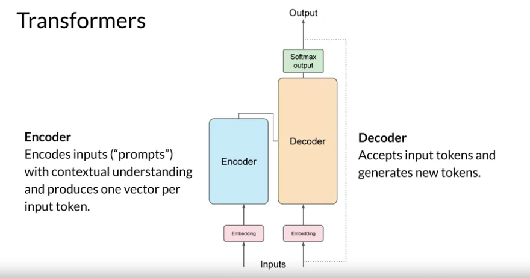
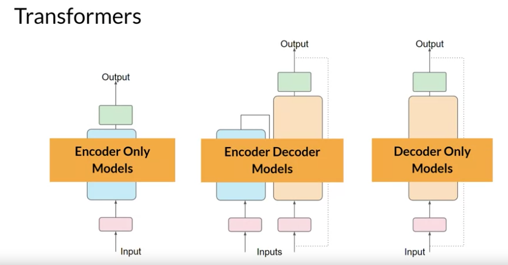

# Scope

## Define the use case - examples

LLMs kunnen gebruikt worden voor:
- question & answering (Q&A) taken:
    - Chatbots
- diverse tekstgeneratie taken:
   - Schrijven van essays op basis van prompts.
   - Samenvatten van gesprekken door dialoog als input te geven.
     
- vertaalopdrachten:
   - traditionele vertalingen tussen talen (bv. Frans-Duits, Engels-Spaans)
   - vertaling van natuurlijke taal naar machinecode (bv. vraag om het gemiddelde van kolommen in een dataframe te berekenen).
     
-  een gerichte taak, zoals het opvragen van informatie.
   Bv. je kan het model vragen om alle personen en plaatsen te identificeren die in een nieuwsartikel worden genoemd. Dit staat bekend als named entity recognition, een woordclassificatietaak. Het begrip van kennis, gecodeerd in de parameters van het model, stelt het in staat om deze taak correct uit te voeren en de gevraagde informatie aan je terug te geven.
   
   
   
   

## Types LLMs
We gaan het huidige landschap van LLMs verkennen en proberen een inzicht krijgen welke LLM geschikt is voor welke use case.

Deze keuze hangt af van waarvoor je het wil gebruiken, van je data, van hoeveel je bereid bent ervoor te betalen,...

Afhankelijk of je het model voor tekst, audio, video, beeld generatie wil gebruiken, ga je een ander type van model kiezen.

- Voor audio and speech recognition zijn 'Whisper'-type modellen een goede keuze. 
  Deze zijn getraind op diverse audio berichten and ze kunnen spraak herkennen in meerdere talen.

- Image generation. Voor het genereren van beelden ('images') zijn DALL-E (van OpenAI) en Midjourney twee bekende keuzes. 

- Text generation. De meeste modellen zijn getraind op tekst generatie, bv. GPT-4, ...

- Multi-modality. Er zijn modellen die verschillende types van data input en output aankunnen, bv. zowel tekst als beelden. Cfr. gpt-4o. Deze is in staat om natural language processing te combineren met to 'visual understanding'.

## Open Source versus Proprietary Modellen
Een andere manier om LLM's (Large Language Models) te categoriseren is of ze open source of proprietary (eigen) zijn.

Open-source modellen zijn modellen die beschikbaar worden gesteld aan het publiek en door iedereen gebruikt kunnen worden. Ze worden vaak vrijgegeven door het bedrijf dat ze heeft gecreëerd of door de onderzoeksgemeenschap. 

pros:
- Deze modellen mogen worden geïnspecteerd, aangepast en op maat gemaakt voor verschillende toepassingen van LLM's.

potentiële cons:
- Ze zijn niet altijd geoptimaliseerd voor productiegebruik
- Ze kunnen veelal minder goed presteren dan proprietary modellen.
- De financiering voor open-source modellen kan beperkt zijn
- Ze worden mogelijk niet op lange termijn onderhouden of bijgewerkt met de nieuwste onderzoeken.

Voorbeelden van populaire open-source modellen zijn Alpaca, Bloom, LLaMA en Mistral.

Proprietary modellen zijn modellen die eigendom zijn van een bedrijf en niet openbaar beschikbaar worden gesteld. 

pros:
- Deze modellen zijn vaak geoptimaliseerd voor productiegebruik.

cons:
- Ze mogen niet worden geïnspecteerd, aangepast of op maat gemaakt voor verschillende toepassingen.
- Ze niet altijd gratis beschikbaar, er kan een abonnement of betaling vereist zijn om ze te gebruiken.
- Gebruikers hebben ook geen controle over de gegevens die worden gebruikt om het model te trainen, wat betekent dat ze erop moeten vertrouwen dat de eigenaar van het model zich inzet voor gegevensprivacy en verantwoord gebruik van AI.

Voorbeelden van populaire proprietary modellen zijn de modellen van OpenAI, Google Bard of Anthropic (Claude modellen).

## Encoder-Decoder versus Decoder-only  
Om de verschillende typen architecturen van LLM's (Large Language Models) te bespreken, laten we een analogie gebruiken.

Stel je voor dat je gevraagd wordt om een cursus te schrijven. Je hebt twee collega’s; de één is verantwoordelijk voor het maken van de inhoud en de ander voor het beoordelen / interpreteren ervan.

De inhoudmaker is als een **Decoder-only** model: het kan naar het onderwerp kijken, zien wat je al hebt geschreven en dan een cursus schrijven op basis daarvan. Ze zijn heel goed in het schrijven van boeiende en informatieve inhoud (dus in het genereren van teksten), maar ze zijn niet zo goed in het begrijpen van het onderwerp. Enkele voorbeelden van Decoder-modellen zijn modellen uit de GPT-familie, zoals GPT-3. Decoder-only modellen worden ook 'auto-regressive models' genoemd.

De beoordelaar is als een **Encoder-only** model: de beoordelaar kijkt naar de geschreven cursus en de antwoorden, en begrijpt de relatie ertussen. De beoordelaar 'begrijpt' de context, maar is zijn niet goed in het genereren van inhoud. Een encoder-only model is bv. goed in classificatietaken, zoals sentimentanalyse. Een voorbeeld van een Encoder-only model is BERT. Encoder-only modellen worden ook 'auto-encoding models' genoemd.

Stel je voor dat we iemand hebben die zowel de cursus kan maken als beoordelen, dat is een **Encoder-Decoder** model. Dit type modellen werkt goed voor bv. vertalingen of het maken van samenvattingen. Hiervoor dient er zowel begrip te zijn van de tekst, als dat er tekst gegenereerd moet worden. Voorbeelden hiervan zijn BART en T5.

## Service versus Model  
Nu, laten we het hebben over het verschil tussen een service en een model. Een service is een product dat wordt aangeboden door een cloud service provider, en bestaat vaak uit een combinatie van modellen, data en andere componenten. Een model is het kernonderdeel van een service en is vaak een basismodel, zoals een LLM.

Services zijn vaak geoptimaliseerd voor gebruik in productie en zijn vaak eenvoudiger te gebruiken dan modellen, via een grafische gebruikersinterface. Services zijn echter niet altijd gratis beschikbaar en kunnen een abonnement of betaling vereisen in ruil voor het gebruik van de apparatuur en middelen van de service-eigenaar, waardoor kosten geoptimaliseerd worden en opschaling eenvoudiger is. Een voorbeeld van een service is de **Azure OpenAI Service**, **Google Colab**, **EdenAI**.

Modellen zijn slechts het neuraal netwerk, met de parameters, gewichten, enzovoort. Bedrijven kunnen deze lokaal draaien, maar hiervoor moeten ze wel apparatuur aanschaffen, een infrastructuur opzetten om op te schalen en een licentie kopen of een open-source model gebruiken. Een model zoals **LLaMA** is beschikbaar om te gebruiken, maar vereist rekenkracht om het model te laten draaien.
