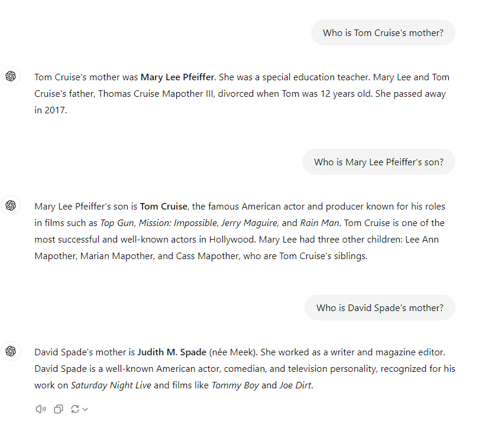

# Oefen
We kunnen een aantal dingen eens uitproberen.

- Surf naar https://huggingface.co/ \
- Zoek de model card van het model meta-llama/Llama-3.1-8B-Instruct. \
- Vraag toegang tot het model. \
- Lees de model card.
- Kijk wat de opties zijn onder "Deploy" en "Use this model"

Stel dat het niet lukt om toegang te krijgen tot meta-llama/Llama-3.1-8B-Instruct, dan kan je een ander text generation model kiezen.

## Temperature
Stel een vraag aan een model en zet de temperatuur van het model eens op 0, 1, 1.5, misschien zelfs 2.
Hoe wijzigt de output van het model?

Voorbeelden van een vraag:
- "Write me a short description for a business card of a software developer."
- "Hoeveel is 2 + 2?"
- ...

Hieronder staat code van in 2024. Deze is niet up to date, maar werkt nog. \ 
We gebruiken de InferenceClient, wat wil zeggen dat de code draait bij een
inference provider. \
Vervang de code door de code die nu aangeraden wordt om met het model te werken via een inference provider. \
Pas ze indien nodig aan, zodat ze correct werkt. 

Welke inference provider is beschikbaar voor het meta-llama/Llama-3.1-8B-Instruct model?

from huggingface_hub import InferenceClient

client = InferenceClient(
    "meta-llama/Meta-Llama-3-8B-Instruct",
)

for message in client.chat_completion(
	messages=[{"role": "user", "content": "How far is it from the Earth to the moon?"}],
	max_tokens=100,
	stream=True,
  temperature=0,
):
    # print(message.choices[0].delta.content, end="")
    if len(message.choices) == 0:
      break
    if message.choices[0].delta.content is None:
      continue
    
    print(message.choices[0].delta.content, end="")

Gebruik ook eens de code gebruik maakt van de transformers library. Je vindt deze in de model card. 

Onder 'Use this model' vind je de code voor het gebruik van de transformers ook, alsook een starter notebook om bv. met Google Colab te gebruiken.

## Reversal curse

"We expose a surprising failure of generalization in auto-regressive large language
models (LLMs). If a model is trained on a sentence of the form “A is B”, it will
not automatically generalize to the reverse direction “B is A”. This is the Reversal
Curse. ... The Reversal Curse is robust across model sizes and model families
and is not alleviated by data augmentation. We also evaluate ChatGPT (GPT3.5 and GPT-4) on questions about real-world celebrities, such as “Who is Tom
Cruise’s mother? [A: Mary Lee Pfeiffer]” and the reverse “Who is Mary Lee
Pfeiffer’s son?”. GPT-4 correctly answers questions like the former 79% of the
time, compared to 33% for the latter. This shows a failure of logical deduction that
we hypothesize is caused by the Reversal Curse."

ref.:https://arxiv.org/pdf/2309.12288v1

Vraag eens aan "meta-llama/Meta-Llama-3-8B-Instruct": 
- "Who is Tom Cruise's mother?" en daarna:
- “Who is Mary Lee Pfeiffer’s son?”

Kies een ander model en stel dezelfde vragen.

Hier zie je de antwoorden die ik kreeg wanneer ik ChatGPT-3.5-turbo, resp. ChatGPT4_o gebruikte.

## Raspberry
Vraag eens aan "meta-llama/Meta-Llama-3-8B-Instruct" of/en aan een ander model om het aantal 'r-en' in het woord 'strawberry' te tellen.

Krijg je het juiste antwoord? 
Hoe zou dit komen?

