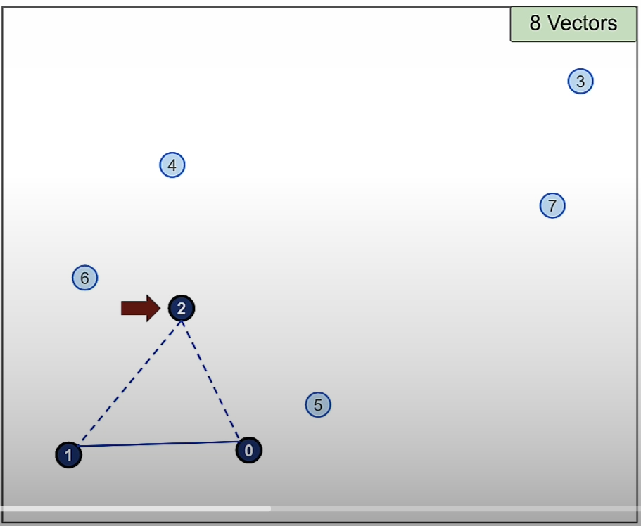
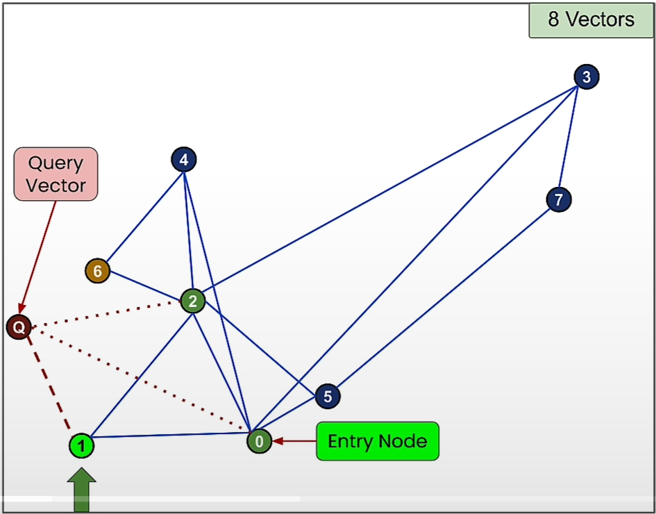

# vector databank

## inleiding

'Klassieke' (relationele) databanken zijn erg goed in het opslaan en ophalen van grote hoeveelheden data, zolang je op zoek gaat naar data die opgeslagen is. Exact wat we van klassieke databanken verwachten, iets opslaan om later weer op te halen. Gestructureerde data met duidelijke relaties, relationele databanken zijn uiterst geschikt om hierop performante complexe queries uit te voeren.

Binnen machine learning wordt data efficiënter voorgesteld als vector data. Vaak werken we met hoog dimensionale data, die kan makkelijk(er) worden voorgesteld als punten in een hoog dimensionale ruimte.

We moeten ook vaak op zoek gaan naar 'gelijkaardige' resultaten, veeleer dan exact terug vinden wat we er eerder instopten. Na het trainen van een neuraal netwerk is het net niet de bedoeling om de input data exact terug te krijgen.

In de vectorruimte worden gelijkenis en verschil tussen datapunten vaak berekend op basis van de afstand tussen hun vectorrepresentaties  (bijvoorbeeld via de Euclidische afstand), dus hebben we ook hiervoor baat bij vector data.

## gelijkaardige data zoeken

Gelijkaardige data zoeken op basis van numerieke criteria is sowieso simpel en efficiënt. Stel als voorbeeld dat we een schoenenwinkel website beheren, alle schoenen ophalen van maat 44 tot 46, of alle schoenen die tussen €100 en €150 kosten zijn triviale queries, waarvoor relationele databanken heel geschikt zijn.

Maar wat als we ook 'gelijkaardige' resultaten willen opvragen. Als de klant zoekt naar 'zwarte schoen', willen we sectie op de site "misschien interesseren deze schoenen jou ook" waar we bijvoorbeeld ook donkerblauwe schoenen tonen in hetzelfde model, maar geen witte.

Het systeem moet dus op een manier kunnen voorstellen dat 'donkerblauw' meer verwant is met 'zwart' dan dat 'wit' dat is. Dit soort kenmerken worden heel vaak als vectors voorgesteld. Door elk van de kenmerken op een andere as voor te stellen binnen een multi dimensionale ruimte, wordt welke data gelijkaardig is aan andere data makkelijk te definiëren.

De juiste kenmerken op de juiste manier voorstellen is een kunst op zich. Jullie hebben vorig jaar bij machine learning allerlei methodes geleerd om hiermee om te gaan (feature scaling, ordinal encoder, attribute combinations, ...). We gaan er nu verder vanuit dat dit gelukt is, elk kenmerk van onze data is mooi geëncodeerd en goed geschaald. (bvb. het kenmerk 'kleur' van wit tot zwart en alles ertussen, of neem 'stijlvol', van de minst stijlvolle schoenen (crocs?) tot de chiqueste Italiaans lederen schoenen, enz.)

(automatisch kenmerken genereren uit een set van data met machine learning is soms ook een optie, dat leren jullie dit jaar in Deep Learning)

Eens gecodeerd is er in principe niets dat ons tegenhoudt om deze data in verschillende kolommen van een relationele databank te steken, en dan er verschillende queries op los te laten om gegeven één schoen uit deze kolommen de meest gelijkaardige schoenen te vinden. Maar het zal een oplossing zijn die bijzonder slecht schaalt, en dus niet geschikt is als we vaak snel, over grote hoeveelheden data, zo'n operaties willen doen.

We hebben een beter model nodig.

## vector databanken

Vector databanken zijn een poging om deze vectoren op te slaan op een zodanige manier dat we snel gelijkaardige data kunnen vinden.

Als we ons als voorbeeld even beperken tot twee kenmerken (in twee dimensies tekenen is wat makkelijker), dan wordt elke schoen voorgesteld als een vector van twee attributen, of dus een punt in ons vlak.

Gelijkaardige schoenen, zijn dan schoenen die zich dichtbij een schoen bevinden. De afstand tussen twee punten binnen onze vectorruimte kunnen we op verschillende manieren meten (euclidische afstand, manhattan afstand, cosinus, ...).

Als voorbeeld zoeken we de drie meest gelijkaardige schoenen, of dus dichtste schoenen, op basis van de euclidische afstand.

Visueel is het erg makkelijk om in te schatten welke punten het dichtste bij zijn, maar een computer moet de afstand tussen elk paar punten berekenen

$$
d = \sqrt{(y_2-y_1)^2+(x_2-x_1)^2}
$$

### K-Nearest Neighbors (KNN)

Stel dat we het KNN-algoritme gebruiken om een zwarte, stijlvolle schoen te vinden.

Dan moeten volgende stappen doorlopen worden:
- de afstand moet berekend worden tussen de query (de embedding vector van de "zwarte, stijlvolle schoen") en alle andere vectoren,
- de afstanden dienen gesorteerd te worden,
- de top-k matches worden geselecteerd. Dit zijn punten die semantisch het meest gelijkaardig zijn.

Voordeel van het KNN-algoritme:
- Met dit algoritme kunnen we heel accuraat de 'nearest neighbor' vinden.

Nadeel van het KNN-alogitme:
- Dit schaalt absoluut niet als we immense hoeveelheden data beschouwen. We hebben nood aan andere algoritmen om buren te vinden.

### Approximate Nearest Neighbour (ANN)

Het onderliggend idee is dat je de afstanden tussen vector voorstellingen op voorhand uitrekent, en dat je aan de hand van de resultaten gelijkaardige vectoren dicht bij elkaar gaat opslaan (in clusters of graphs) zodat je later sneller gelijkaardige objecten kan terug vinden.

Eigenlijk berekenen we hier een index op de onderliggende data, net zoals we bij relationele databanken indexen gebruiken om sneller data terug te vinden.

Belangrijk om op te merken is dat we hier **een trade-off maken tussen snelheid en accuraatheid**. We gaan veel sneller de buren vinden, maar het is maar bij benadering ("Approximate")

In ons voorbeeld zou je een cluster van 'donkere schoenen' kunnen aftekenen, als je dan op zoek bent naar de buren van onze bruine Italiaans lederen schoen, gaan we enkel van de schoenen binnen die cluster de afstanden berekenen (en dus niet langer vanuit onze groene crocs).

Er zijn vele manieren om data in clusters e.d. in te delen, en op die manier de zoekruimte te beperken (en dus een beetje accuraatheid op te offeren om wat snelheid terug te krijgen).

Één van de meer gebruikte ANN algoritmen in moderne vector databanken is Hierarchical Navigable Small Worlds (HNSW). 

Om dat te kunnen uitleggen gaan we eerst een kleine omweg maken.

### The "small world phenomenon" explained 
(author: chatGPT)

Het **small world fenomeen** verwijst naar het idee dat, ondanks de enorme omvang van sociale netwerken, individuen met elkaar verbonden zijn via verrassend korte paden. Met andere woorden, de meeste mensen zijn met elkaar verbonden door een klein aantal tussenliggende connecties, vaak aangeduid als **degrees of separation** (graden van scheiding).

Het concept werd algemeen bekend door een beroemd experiment van sociaal psycholoog Stanley Milgram in de jaren 1960, vaak samengevat als het idee dat **elke twee mensen op aarde door zes of minder sociale connecties van elkaar gescheiden zijn**. Dit wordt populair "six degrees of separation" genoemd.

In sociale netwerken impliceert dit fenomeen:

1. **Korte Paden**: Zelfs in grote netwerken zijn er korte paden die individuen met elkaar verbinden.
2. **Clustered Networks**: Mensen vormen vaak hechte clusters (groepen van vrienden of gemeenschappen), maar deze clusters zijn met elkaar verbonden via een paar belangrijke individuen (mensen met veel connecties), zogenaamde **hubs** of **bridges**.
3. **Hoge Lokale Clustering**: Mensen kennen anderen in hun directe netwerk (familie, vrienden, collega's) vaak goed, maar ze zijn ook verbonden met mensen buiten deze groepen via kennissen.

Dit fenomeen is waargenomen in veel verschillende soorten netwerken, waaronder sociale medianetwerken, de verspreiding van ziektes en zelfs neurale netwerken in de hersenen. Het toont aan hoe gedecentraliseerde, grote systemen toch sterk onderling verbonden kunnen zijn.

### Probability Skip List

Vergeet even waar we mee bezig zijn, beschouw dit volledig nieuw probleem.

Als we een aantal elementen hebben, waarin we snel willen kunnen zoeken, dan is de simpelste methode om ze in een array te steken en Binary Search toe te passen. Als we echter ook snel elementen willen kunnen toevoegen (en we hebben er héél veel) dan hebben we een andere data structuur nodig, een gelinkte lijst.

Binary search is echter niet toe te passen op gelinkte lijst, we kunnen enkel voorwaarts door de lijst gaan, of alleszins niet op een random manier. Maar telkens de gehele lijst doorlopen om een element te vinden is allesbehalve snel, zeker bij grote lijsten.

De oplossing voor dit probleem die William Pugh in 1990 bedacht noemen we een Probability Skip List.

Zoals alle performantie problemen in de informatica, lossen we ook dit op met een trade-off. Veel sneller zoeken met als kost iets meer geheugen gebruik.

We voegen een aantal lagen toe, die telkens meer en meer elementen 'overslaan', een voorbeeld.

Het algoritme werkt nu door in de bovenste laag te starten, en door de hele lijst te gaan (maar dus veel sneller, want heel veel elementen worden overgeslaan). Van zodra we op een element komen dat groter is dan waarnaar we zoeken, keren we een stap terug, en zakken we een laag.

Dit blijven we doen tot we het element gevonden hebben, of op de laagste laag beland zijn.

(Het is belangrijk op te merken dat `laag n-1` altijd misntens alle nodes van `laag n` bevat, anders werkt het algoritme niet.)

Een voorbeeld, we zijn op zoek naar element 9.

### Navigable Small World (NSW)

Navigable Small World is een algoritme waar het uitgangspunt is dat er een beperkt aantal nodes zijn in de wereld (vandaar 'small world'), en dat de verschillende nodes enerzijds hun directe (dichte) buren kennen, en anderzijds er hier en daar een verbinding is met een verre buur (en er dus grote sprongen in de wereld kunnen gemaakt worden)

Als je dan vanop een startpunt op zoek gaat naar een bepaalde node kan je via een greedy routing algoritme, dat telkens de node kiest die het dichtst bij ons doel ligt, wel zeer efficiënt een lokaal minimum vinden van een 'dichtste' node.

### Hierarchical Navigable Small World (HNSW)

Als we de vorige twee ideeën combineren bekomen we het HSNW algoritme. We gaan NSW toepassen, maar dan in verschillende layers.

​									(afbeelding bron: pinecone.io)

We passen dezelfde operaties toe dan bij NSW, maar dan layer per layer, we vinden telkens een lokaal minimum, en 'zakken' dan door naar de volgende layer, om een meer precies resultaat te bekomen.

#### Constuction of the small world

In het onderstaande voorbeeld zijn er 8 random gegenereerde vectoren. \
Vectoren worden gerepresenteerd door nodes in een graph. 

Laten we node 0 toevoegen aan de graph. De andere nodes (1-7) zijn in eerste instantie nog niet togevoegd. We gaan bekijken hoe we ze allemaal kunnen connecteren met hun 'nearest neighbors'.

Voeg vector/node 1 toe. De enige mogelijke connectie is nu die tussen nodes 0 en 1.

Voeg vector/node 2 toe. De 2 nearest neighbors van node 2 zijn nodes 0 en 1. Je kan een connectie leggen tussen nodes 0 en 2 en tussen nodes 0 en 1.

Voeg vector/node 3 toe. De twee nearest neighbors van node 3 zijn node 0 en node 2.

Voeg vector /node 4 toe. De twee nearest neighbors van node 4 zijn waarschijnlijk node 0 en node 2.

... Doe zo verder tot je node 7 en zijn connecties hebt toegevoegd.

We hebben nu een "small world" geconstrueerd. Er werd voor gekozen om met 2 nearest neighbors te werken. Je kan bv. ook met 3, 4, ... nearest neighbors werken. 

#### Search of the navigable small world

Hoe kunnen we de "search" gaan doen? Stel dat we nog steeds op zoek zijn naar een zwarte, stijlvolle schoen", dan is de 'Query Vector' in onderstaande figuur de embedding vector van de "zwarte, stijlvolle schoen". De schoen die hier het meest aan voldoet, komt overeen met vector 6, want die is the 'Nearest Neighbor Vector' van de query vector.

Gewoonlijk start je bij een random node in het netwerk (hier: de 'Entry Node'). Je probeert door het netwerk te bewegen naar de 'Nearest Neighbor Vector'

De 'Entry Node', node 7 is geconnecteerd met node 3 en node 5. Node 5 ligt dichter bij de 'Query Vector' dan node 3. We bewegen dus naar node 5. 

Node 5 is geconnecteerd met node 0 en node 2. Node 2 ligt dichter bij de 'Query Vector' dan node 0.

Voor node 2 zijn er verschillende opties, node 6 ligt het dichtst bij de 'Query Vector'. We bewegen naar node 6. Dit is de vector die het dichts bij de 'Query Vector' ligt in deze graph, er zijn geen betere kandidaten. We vonden de 'Nearest Neighbor Vector' waar we naar op zoek waren.

Merk op dat de search in NSW niet altijd resulteert in het vinden van de beste match.
Stel dat we starten bij node 0, dus we kiezen node 0 als 'Entry Node'.

De mogelijke kandidaten zijn aangeduid op de figuur hieronder.

De beste optie in deze stap is vector nummer 1.

Nu zijn er geen betere kandidaten meer en de search stopt hier. We hebben niet het best mogelijke resultaat gevonden, maar we vonden de 'Approximate Nearest Neighbor Vector'.
Dit is een vrij goed resultaat.

#### Search in a Hierarchical Navigable Small World

De 'Hierarchical Navigable Small World' bestaat uit verschillende lagen 'Navigable Small World'.

Stel je het volgende voor: je wil naar een stad ergens in de wereld reizen, bv. Lausanne. Je zal waarschijnlijk eerst het vliegtuig nemen naar het dichtstbijzijnde vliegveld (layer 2). Daarna neem je misschien een trein naar de stad waar je naartoe wil (layer 1). Uiteindelijk, wanneer je op de onderste laag zit, kan je wandelen of misschien een taxi nemen naar je bestemming (layer 0).

De manier van zoeken is dezelfde als die in NSW. Je start bij een 'Entry Node'. Je kan enkel bewegen naar nodes die in de hoogste laag zitten (hier: layer 2). Behalve node 19 zijn ook nodes 7, 9, 12, 18 en 22 aanwezig in Layer 2. Je beweegt naar de node dit het dichtst bij de 'Query Vector' ligt. Hier is dat node 9.

Eens je daar bent, ga je naar de laag eronder (hier: layer 1). Layer 1 bevat alle nodes van de bovenliggende layer 2, maar ook enkele nieuwe nodes en hun connecties: 0, 20, 21, 23.
Je kan naar node 10 bewegen, die het dichtste bij de 'Query Vector' ligt.

De onderste laag (layer 0) bevat opnieuw alle nodes van voorgaande lagen en enkele nieuwe. Je beweegt opnieuw door de graph naar de node die het dichtst bij de 'Query Vector' ligt. Hier is dat opnieuw node 10.

De manier waarop nodes toegewezen worden aan de verschillende lagen is door random een nummer te genereren (in het geval van 2 lagen, is dat random nummer 0, 1 of 2). Dit nummer kent de node aan die laag toe én ook aan alle lagen eronder. De kans om in een lagere laag terecht te komen is logatimisch kleiner dan die om een laag hoger terecht te komen.

Bv. wanneer het random nummer 0 is, zal de node bestaan in laag 0.
Wanneer het random nummer 2 is, zal de node bestaan in laag 0, 1 en 2.

#### HNSW Runtime

Door de manier waarop de lagen opgebouwd worden, kunnen in de bovenste laag 'grote' stappen gezet worden, en in de lagen daaronder alsmaar kleinere stappen om uiteindelijk zo dicht mogelijk bij de Query Vector (de zwarte, stijlvolle schoen of je reisbestemming) te komen.

Wanneer het aantal datapunten stijgt, dan stijgt het aantal vergelijkingen die je moet doen om de vector search te doen enkel logaritmisch.
We spreken van een "O(log(N)) runtime complexity" voor het HNSW algoritme.

Op de figuur zie je dat wanneer je bv. gaat van 500.000 datapunten die aanwezig zijn in je database naar 1.000.000 datapunten, de tijd die nodig is om je een benadering van je 'Query Vector' te vinden niet veel verlengt.
  

### Veelgebruikte indexing technieken in Vectordatabases:
1. **LSH (Locality-Sensitive Hashing):**
   - **Doel:** Brengt vergelijkbare vectoren met grote waarschijnlijkheid in dezelfde hash-bucket.
   - **Hoe het werkt:** Gebruikt hashfuncties die de afstand tussen vergelijkbare vectoren minimaliseren. Door meerdere hashfuncties toe te passen, komen vectoren die dicht bij elkaar liggen in een hoog-dimensionale ruimte in dezelfde hash-buckets terecht, wat snellere gelijkeniszoekopdrachten mogelijk maakt.

2. **Tree-Based Indexes:**
   - **KD-Tree:** Verdeelt de vectorruimte in regio's met behulp van hypervlakken. Hoewel efficiënt voor laag-dimensionale data, verslechtert de prestaties in hoge dimensies.
   - **VP-Tree (Vantage Point Tree):** Gebruikt afstanden vanaf een referentiepunt (vantage point) om de ruimte te verdelen, wat beter geschikt is voor hoog-dimensionale vectorruimtes.

3. **HNSW (Hierarchical Navigable Small World Graph):**
   - **Doel:** Bouwt een grafiek waarbij nodes vectoren vertegenwoordigen en edges nabijgelegen vectoren verbinden.
   - **Hoe het werkt:** Het zoeken omvat het doorlopen van deze grafiek, waarbij dichterbij gelegen buren in opeenvolgende lagen worden verkend, wat leidt tot efficiënte benaderende nabijheidszoekopdrachten.

4. **FAISS (Facebook AI Similarity Search):**
   - Een sterk geoptimaliseerde 'vector indexing library' die meerdere indexeringstechnieken ondersteunt, zoals **flat indexing** en **inverted file indexes**, ontworpen voor zowel exacte als benaderende zoekopdrachten in zeer grote datasets.
  
**Oefening**
Beschrijf de indexing methode inverted file index.

### Hoe vector indexen verschillen van traditionele indexen:
- **Hoog-dimensionale data:** In tegenstelling tot traditionele relationele database-indexen die omgaan met scalaire waarden (bijv. gehele getallen, strings), werken vectorindexen in een **hoog-dimensionale ruimte** (bijv. 512 of 1024 dimensies).
- **Gelijkenis boven exacte overeenstemming:** Traditionele indexen zijn gebouwd voor exacte opzoekingen (bijv. het vinden van een rij met een specifieke sleutel). Vectorindexen richten zich op **gelijkenismaten** (bijv. Euclidische afstand, cosinusgelijkenis) om gegevenspunten te vinden die dichtbij zijn in de vectorruimte.

Samengevat is de index in een vectordatabase ontworpen voor het efficiënt ophalen van hoog-dimensionale vectoren, waardoor snelle similarity searches mogelijk worden gemaakt in grote datasets met behulp van gespecialiseerde technieken zoals HNSW en FAISS.

### Available vector databases.

Een van de meest gebruikelijke manieren om ongestructureerde gegevens op te slaan en doorzoekbaar te maken, is door ze te embedden en de resulterende vectoren op te slaan. Vervolgens embed je de ongestructureerde query en haal je de vectoren (embeddings) op die het 'meest vergelijkbaar' zijn met de geëmbedde query. Een vectorstore zorgt voor het opslaan van geëmbedde gegevens en voert de vectorzoekopdracht voor je uit.

De meeste vectorstores kunnen ook metadata over geëmbedde vectoren opslaan en ondersteunen filtering op die metadata voorafgaand aan een similarity search, waardoor je meer controle hebt over de teruggegeven documenten.

Een vector database heeft als doel:
- vector-embeddings **opslaan**,
- vector-embeddings te **indexeren**,
- vector-embeddings **op te halen** voor toepassingen zoals semantische zoekopdrachten, bv. voor recommandations.

#### Wat sla je op in een vector database?
- **Embeddings** van documenten, text chunks, beelden, of andere data types. 
- **Metadata**: dit kan het originele document bevatten, chunk IDs, titels van documenten, timestamps, of andere contextuele informatie om het ophalen of filteren van resultaten te vergemakkelijken.

#### Een voorbeeld van een workflow wanneer je met een vector database werkt:
1. **Split document** into smaller chunks.
2. **Choose embedding model** (e.g., `text-embedding-ada-002`).
3. **Convert chunks** into vector embeddings using the model.
4. **Store embeddings** along with metadata in the vector database.

Er bestaan zowel open source vector databases, als proprietary vector databases.

Elk van die databases heeft zijn eigen sterktes, afhankelijk van de use case: 
- dataset size,
- de scalability vereisten,
- het beheer

#### Oefening:
1. Vergelijk bijvoorbeeld Pinecone, ChromaDB en Milvus op basis van:
- de dataset size waarmee ze kunnen werken,
- de scalability,
- het beheer,

https://docs.pinecone.io/guides/data/understanding-hybrid-search
https://docs.trychroma.com/getting-started
https://docs.trychroma.com/guides
https://milvus.io/docs/basic_usage_langchain.md

2. Wat is het nut van collections/namespaces?

#### 1. ChromaDB
- een **open-source vector database** :
  het geeft developers controle over de database, wat ideaal is wanneer je een self-hosted oplossing nodig hebt, of wanneer je de database wil customizen.
- embeddings van verschillende modaliteiten kunnen opgeslagen worden: tekst, beeld of audio.
- toepassingen: AI applicaties die semantic search gebruiken, bv. recommender systems, image search.
- voor kleine tot medium grote projecten.
  
#### 2. Pinecone
- een **beheerde, cloudgebaseerde vector database**, de infrastructuur, scalability en maintenance worden verzorgd door Pinecone.
-  Dit maakt het aantrekkelijk voor grootschalige toepassingen of ondernemingen die hun eigen infrastructuur niet willen beheren.
- schaalbaarheid en Snelheid: Pinecone is geoptimaliseerd voor snelle vectorzoekopdrachten in grote datasets, waardoor het geschikt is voor realtime toepassingen met hoge throughput vereisen.
- Integratie met ML-modellen: Pinecone kan embeddings opslaan van modellen zoals OpenAI’s GPT, BERT, CLIP,... en ondersteunt realtime zoekopdrachten, aanbevelingssystemen en rangschikkingstaken.

#### 3. Milvus
- een open-source vector database, deze biedt meer flexibiliteit in beheer dan Pinecone.
- deze maakt gebruik van HNSW, FAISS, ...

### Hybrid search

Dit betekent dat je zowel vector-based als keyword-based zoekopdrachten kunt combineren in één query.

Hybrid search stelt je in staat om het beste van beide werelden te gebruiken:

Vector search: Gebruikt embeddings (numerieke representaties) om op basis van semantische overeenkomsten te zoeken in ongestructureerde data, zoals tekst, afbeeldingen, of andere media. Dit is handig om resultaten te vinden die conceptueel gerelateerd zijn, zelfs als de exacte woorden niet overeenkomen.
Keyword search: Gebruikt traditionele zoektechnieken die zoeken naar exacte trefwoorden of termen in de data, wat handig is als je specifieke woorden of zinnen wilt vinden.

Door deze zoekmethoden te combineren, kun je nauwkeurigere zoekresultaten krijgen door zowel te profiteren van de semantische kracht van embeddings als de precisie van keyword matching.

ref. documentatie van Pinecone: 
https://docs.pinecone.io/guides/data/understanding-hybrid-search

In Pinecone, you perform hybrid search with sparse-dense vectors. Sparse-dense vectors combine dense and sparse embeddings as a single vector. Sparse and dense vectors represent different types of information and enable distinct kinds of search.

​
Dense vectors
The basic vector type in Pinecone is a dense vector. Dense vectors enable semantic search. Semantic search returns the most similar results according to a specific distance metric even if no exact matches are present. This is possible because dense vectors generated by embedding models such as SBERT are numerical representations of semantic meaning.

​
Sparse vectors
Sparse vectors have very large number of dimensions, where only a small proportion of values are non-zero. When used for keywords search, each sparse vector represents a document; the dimensions represent words from a dictionary, and the values represent the importance of these words in the document. Keyword search algorithms like the BM25 algorithm compute the relevance of text documents based on the number of keyword matches, their frequency, and other factors.

### Afstandsmaten
#### Euclidische afstand

#### Manhatten adstand

#### dot product

#### cosine distance (1-cosine similarity)

