# Quantization

Een van de meest voorkomende problemen waarmee je nog steeds te maken krijgt wanneer je grote taalmodellen probeert te trainen, is een tekort aan geheugen. 
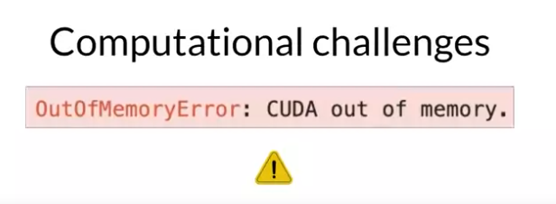

Als je ooit hebt geprobeerd je model te trainen of zelfs alleen maar te laden op Nvidia GPU's, komt dit foutbericht je misschien bekend voor. \
CUDA, wat staat voor Compute Unified Device Architecture, is een verzameling bibliotheken en tools ontwikkeld voor Nvidia GPU's. Bibliotheken zoals PyTorch en TensorFlow gebruiken CUDA om de prestaties te verbeteren bij matrixvermenigvuldigingen en andere bewerkingen die veel voorkomen bij deep learning. 

Je zult te maken krijgen met deze out-of-memory-problemen omdat de meeste LLM's (Large Language Models) enorm zijn en veel geheugen vereisen om al hun parameters op te slaan en te trainen. Laten we wat snelle wiskunde doen om een gevoel te krijgen voor de schaal van het probleem. Een enkele parameter wordt meestal weergegeven door een 32-bits float, wat een manier is waarop computers reële getallen weergeven. Een 32-bits float neemt vier bytes geheugen in beslag. Dus om één miljard parameters op te slaan, heb je vier bytes nodig keer één miljard parameters, oftewel vier gigabyte GPU-geheugen bij 32-bits volledige precisie. 

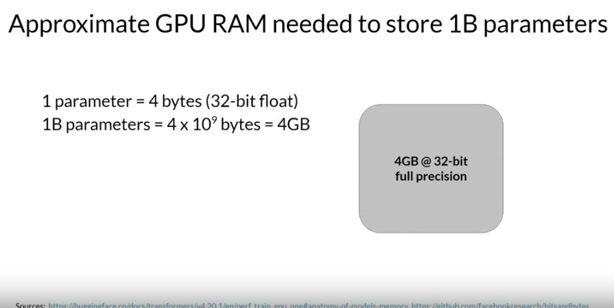
Dit is veel geheugen, en let op, we hebben tot nu toe alleen rekening gehouden met het geheugen om de modelgewichten op te slaan. Als je het model wilt trainen, moet je ook rekening houden met extra componenten die GPU-geheugen gebruiken tijdens de training. Dit omvat twee Adam optimizer-states, gradients, activaties en tijdelijke variabelen die nodig zijn voor je functies. Dit kan gemakkelijk leiden tot 20 extra bytes geheugen per modelparameter. In feite heb je, om rekening te houden met al deze overhead tijdens de training, ongeveer zes keer zoveel GPU-geheugen nodig als alleen de modelgewichten innemen. Om een model met één miljard parameters te trainen bij 32-bits volledige precisie, heb je ongeveer 24 gigabyte GPU-geheugen nodig. Dit is zeker te groot voor consumentenhardware en zelfs uitdagend voor hardware die wordt gebruikt in datacenters, als je met één processor wilt trainen.

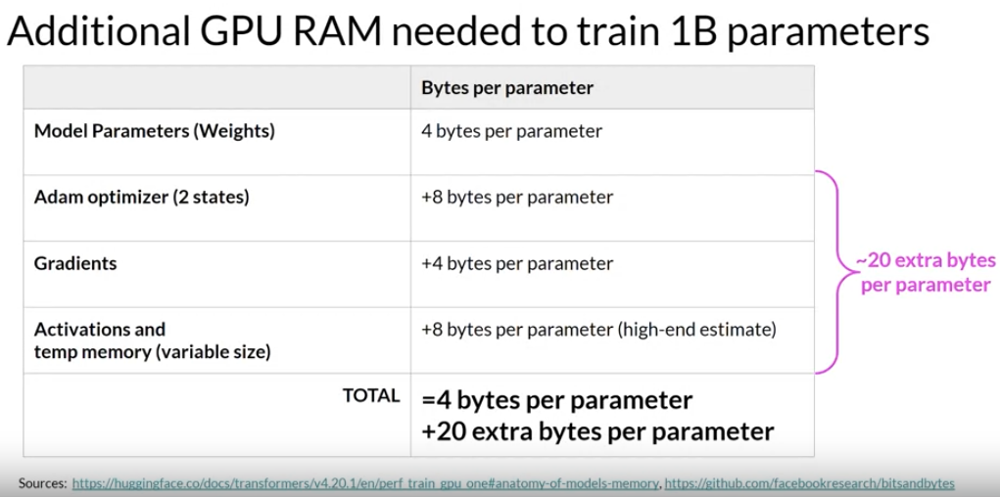

Welke opties heb je om het geheugen dat nodig is voor training te verminderen? Een techniek die je kunt gebruiken om het geheugen te verminderen, heet kwantisatie. Het idee hierbij is dat je het geheugen dat nodig is om de gewichten van je model op te slaan, vermindert door hun precisie te verlagen van 32-bits floating point getallen naar 16-bits floating point getallen, of acht-bits integer getallen. 

De overeenkomstige datatypes die in deep learning-frameworks en -bibliotheken worden gebruikt, zijn:
- FP32 voor 32-bits volledige precisie,
- FP16 of Bfloat16 voor 16-bits halve precisie,
- int8 voor acht-bits integers.

Het bereik van getallen dat je kunt weergeven met FP32 gaat van ongeveer -3 * 10^38 tot 3 * 10^38. Standaard worden modelgewichten, activaties en andere modelparameters opgeslagen in FP32. Kwantisatie projecteert de originele 32-bits floating point getallen statistisch in een ruimte met lagere precisie, met behulp van schaalfactoren die worden berekend op basis van het bereik van de originele 32-bits floating point getallen. 

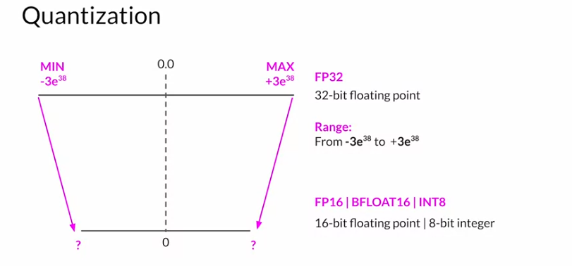

Laten we een voorbeeld bekijken. Stel dat je het getal 'pi' tot 6 decimalen na de komma wilt opslaan. Floating point getallen worden opgeslagen als een reeks bits, nullen en enen. De 32 bits die nodig zijn om getallen op te slaan in volledige precisie met FP32, bestaan uit één bit voor het teken (waarbij nul een positief getal aangeeft en één een negatief getal), acht bits voor de exponent van het getal, en 23 bits voor de breuk van het getal. De breuk wordt ook wel de mantisse of significand genoemd. Het vertegenwoordigt de precisiebits van het getal. Als je de 32-bits floating point waarde terug converteert naar een decimale waarde, merk je een klein verlies aan precisie. Ter referentie, hier is de echte waarde van pi tot 19 decimalen.

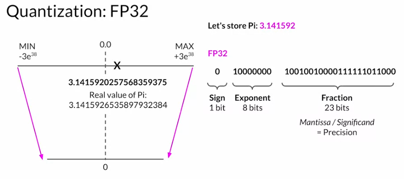

Nu, laten we eens kijken wat er gebeurt als je deze FP32-weergave van pi projecteert in de FP16, 16-bits lagere precisieruimte. \ 
De 16 bits bestaan uit één bit voor het teken, zoals je zag bij FP32, maar nu kent FP16 slechts vijf bits toe om de exponent weer te geven en 10 bits om de breuk weer te geven. Daarom is het bereik van getallen dat je kunt weergeven met FP16 veel kleiner, van -65.504 tot +65.504. \
De originele FP32-waarde wordt geprojecteerd op 3.140625 in de 16-bits ruimte. Merk op dat je wat precisie verliest bij deze projectie. Er zijn nu slechts zes cijfers na de komma. Je zult merken dat dit precisieverlies in de meeste gevallen acceptabel is, omdat je probeert te optimaliseren voor geheugenvoetafdruk. Het opslaan van een waarde in FP32 vereist vier bytes geheugen. Ter vergelijking: het opslaan van een waarde in FP16 vereist slechts twee bytes geheugen, dus met kwantisatie heb je de geheugenvraag gehalveerd. 

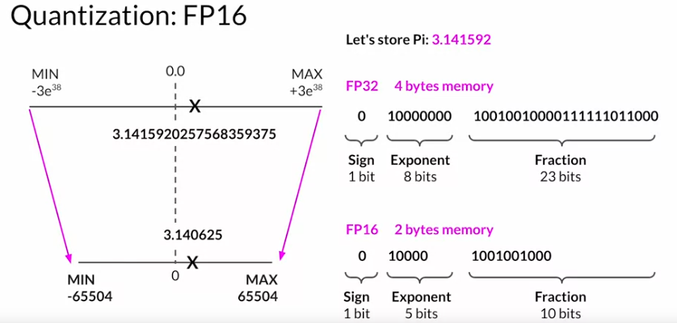

De AI-onderzoekscommunity heeft manieren onderzocht om 16-bits kwantisatie te optimaliseren. Een datatype in het bijzonder, BFLOAT16, is recent een populair alternatief geworden voor FP16. BFLOAT16, kort voor Brain Floating Point Format, ontwikkeld door Google Brain, is een populaire keuze geworden in deep learning. Veel LLM's, waaronder FLAN-T5, zijn voorgetraind met BFLOAT16. BFLOAT16 of BF16 is een hybride tussen halve precisie FP16 en volledige precisie FP32. BF16 helpt aanzienlijk bij de stabiliteit van training en wordt ondersteund door nieuwere GPU's zoals de NVIDIA A100. BFLOAT16 wordt vaak beschreven als een ingekorte 32-bits float, omdat het het volledige dynamische bereik van de volledige 32-bits float vastlegt, maar slechts 16 bits gebruikt. BFLOAT16 gebruikt de volledige acht bits om de exponent weer te geven, maar kort de breuk in tot slechts zeven bits. Dit bespaart niet alleen geheugen, maar verhoogt ook de prestaties van het model door berekeningen te versnellen. Het nadeel is dat BF16 niet goed geschikt is voor integer-berekeningen, maar deze zijn relatief zeldzaam in deep learning.

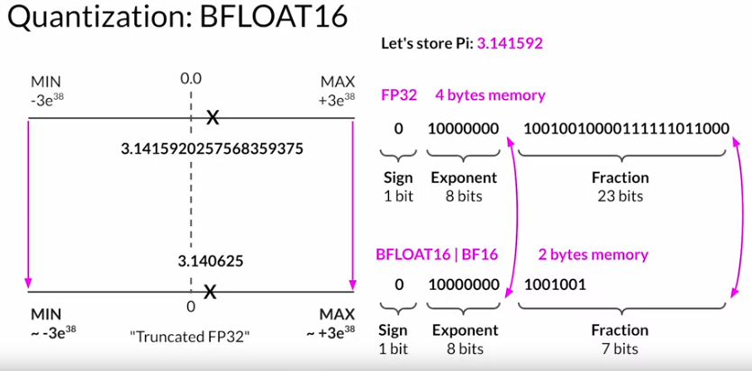

Voor de volledigheid, laten we eens kijken wat er gebeurt als je pi kwantiseert van de 32-bits naar de nog lagere precisie van acht bits. Als je één bit gebruikt voor het teken, worden INT8-waarden weergegeven door de resterende zeven bits. Dit geeft je een bereik om getallen weer te geven van -128 tot +127, en niet verrassend wordt pi geprojecteerd op twee of drie in de 8-bits lagere precisieruimte. Dit brengt de geheugenvraag terug van oorspronkelijk vier bytes naar slechts één byte, maar leidt uiteraard tot een behoorlijk dramatisch verlies aan precisie. 

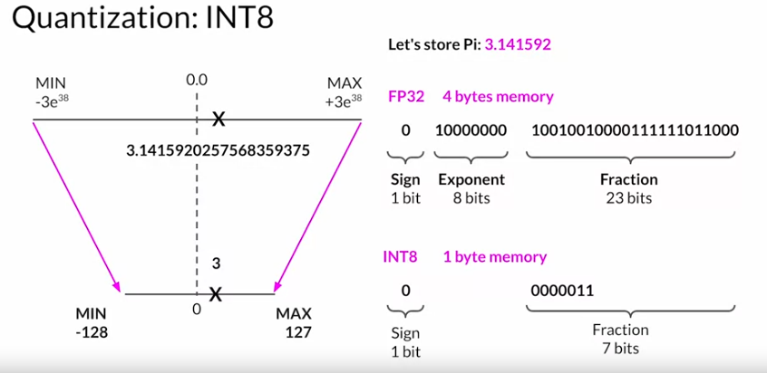

Samengevat, onthoud dat het doel van kwantisatie is om het geheugen te verminderen dat nodig is om modellen op te slaan en te trainen door de precisie van de modelgewichten te verlagen. Moderne deep learning-frameworks en -bibliotheken ondersteunen kwantisatie-bewuste training. BFLOAT16 is een populaire keuze voor precisie in deep learning geworden, omdat het het dynamische bereik van FP32 behoudt, maar de geheugenvoetafdruk halveert. Veel LLM's, waaronder FLAN-T5, zijn voorgetraind met BFLOAT16.

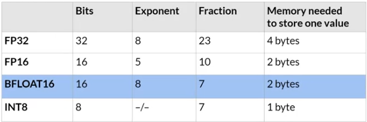

Laten we nu terugkeren naar de uitdaging om modellen in GPU-geheugen te passen en eens kijken naar de impact die kwantisatie kan hebben. Door kwantisatie toe te passen, kun je je geheugengebruik dat nodig is om de modelparameters op te slaan, verminderen tot slechts twee gigabyte door gebruik te maken van 16-bits halve precisie, wat een besparing van 50% oplevert, en je zou de geheugenvoetafdruk verder kunnen verminderen met nog eens 50% door de modelparameters weer te geven als acht-bits integers, waarvoor slechts één gigabyte GPU-geheugen nodig is. Let op dat je in al deze gevallen nog steeds een model hebt met één miljard parameters. Zoals je kunt zien, zijn de cirkels die de modellen vertegenwoordigen even groot. 

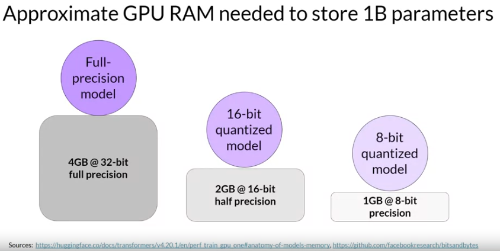

Kwantisatie zal je dezelfde mate van besparing opleveren als het gaat om training. Veel modellen hebben nu echter groottes van meer dan 50 miljard of zelfs 100 miljard parameters. Dit betekent dat je tot 500 keer meer geheugencapaciteit nodig hebt om ze te trainen, wat neerkomt op tienduizenden gigabytes. Deze enorme modellen overtreffen het model met één miljard parameters dat we hebben overwogen, zoals links te zien

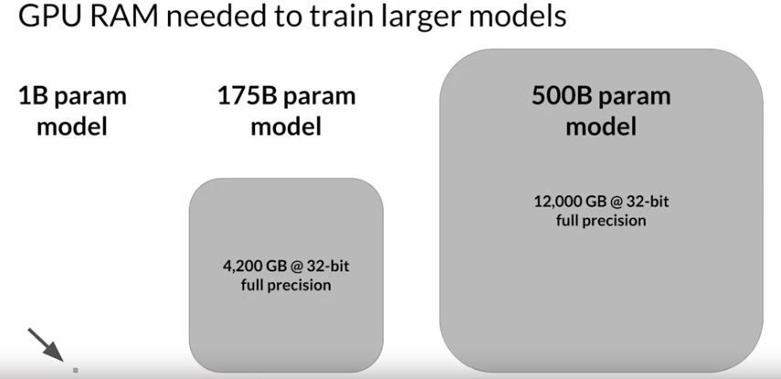
