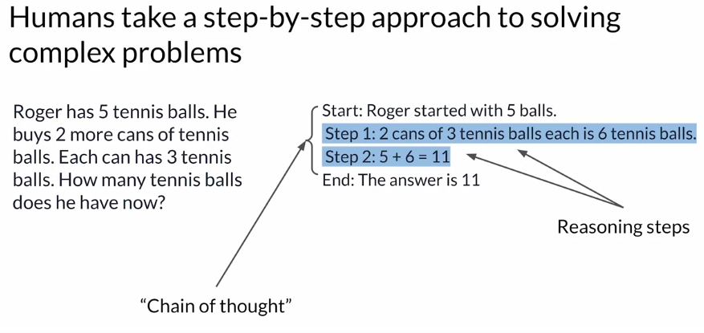
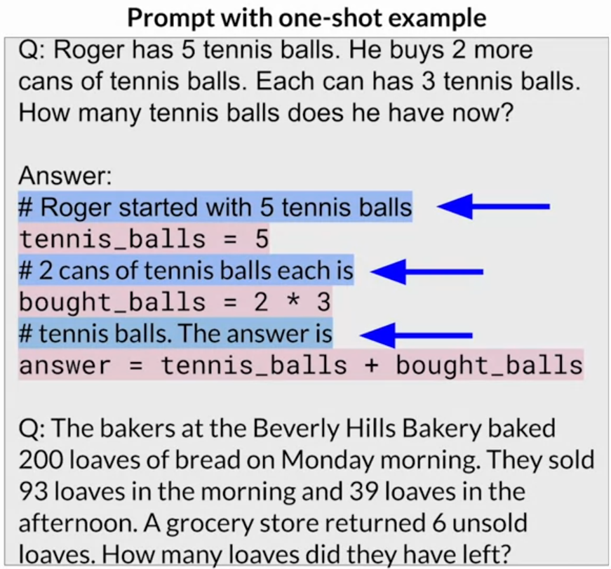

# LLM powered applications

Although training, finetuning and aligning with human preferences can help you build a great model for your application, there are some challenges with large language models that can't be solved by training alone. Let's take a look at a few examples. 

- One issue is that the internal **knowledge** held by a model **cuts off** at the moment of pretraining. For example, if you ask a model that was trained in early 2022 who the British Prime Minister is, it will probably tell you Boris Johnson. This knowledge is out of date. The model does not know that Johnson left office in late 2022 because that event happened after its training. 

- Lastly, one of the best known problems of LLMs is their tendency to generate text even when they don't know the answer to a problem. This is often called **hallucination**, and here you can see the model clearly making up a description of a nonexistent plant, the Martian Dunetree. Although there is still no definitive evidence of life on Mars, the model will happily tell you otherwise.

- Models can also **struggle with complex reasoning**. If you prompt a model to behave like a calculator, it may get the answer wrong, depending on the difficulty of the problem. Here, you ask the model to carry out a division problem. The model returns a number close to the correct answer, but it's incorrect. Note the LLMs do not carry out mathematical operations. They are still just trying to predict the next best token based on their training, and as a result, they can easily get the answer wrong.

In this lesson, you'll learn about some techniques that you can use to help your LLM overcome these issues by *connecting to external data sources and applications*.

You'll have some work to be able to connect your LLM to these external components and fully integrate everything for deployment within your application. Your application must manage 
- the passing of user input to the large language model
- and the return of completions.

This is often done through some type of orchestration library. One implementation example is Langchain, we'll learn about it in this lesson. 

Let's start by considering how to connect LLMs to external data sources.

## Retrieval Augmented Generation (RAG)
Retrieval Augmented Generation or RAG for short, is a framework for building LLM powered systems that make use of external data sources and applications to overcome some of the limitations of these models. RAG is a great way to overcome the knowledge cutoff issue and help the model update its understanding of the world.

While you could retrain the model on new data, this would quickly become very expensive. It would require repeated retraining to regularly update the model with new knowledge. A more flexible and less expensive way to overcome knowledge cutoffs is to give your model access to additional external data at inference time. 

RAG is useful in any case where you want the language model to have access to data that it may not have seen. This could be 
- new information documents not included in the original training data,
- or proprietary knowledge stored in your organization's private databases.

Providing your model with external information, can improve both the relevance and accuracy of its completions. 

Let's take a closer look at how this works. A number of different implementations exist, and the one you choose will depend on the details of your task and the format of the data you have to work with.

referentie: https://cookbook.openai.com/examples/evaluation/evaluate_rag_with_llamaindex

## Stages within RAG

There are **six key stages within RAG**, which in turn will be a part of any larger application you build. These are:

**Loading**: this refers to getting your data from where it lives – whether it’s text files, PDFs, another website, a database, or an API – into your pipeline. LlamaHub provides hundreds of connectors to choose from.

**Indexing**: this means creating a data structure that allows for querying the data. For LLMs this nearly always means creating vector embeddings, numerical representations of the meaning of your data, as well as numerous other metadata strategies to make it easy to accurately find contextually relevant data.

**Storing**: Once your data is indexed, you will want to store your index (for example in a vectorstore), along with any other metadata, to avoid the need to re-index it.

**Querying**: for any given indexing strategy there are many ways you can utilize LLMs and LlamaIndex data structures to query, including sub-queries, multi-step queries and hybrid strategies.

**Evaluation**: a critical step in any pipeline is checking how effective it is relative to other strategies, or when you make changes. Evaluation provides objective measures of how accurate, faithful and fast your responses to queries are.

**Generation**: The question and the relevant context, retrieved by querying the (external) data are combined in a prompt, which is sent to an LLM. The LLM generates an output, based on it's internal 'knowledge' and enriched by the context information added to the prompt.

Note that implementing RAG is a little more complicated than simply adding text into the large language model. There are a couple of key considerations to be aware of.

- First, there is the size of the context window. Most text sources are too long to fit into the **limited context window** of the model, which is still at most just a few thousand tokens. Instead, the external data sources are chopped up into many chunks, each of which will fit in the context window. Packages like Langchain can handle this work for you. 

- Second, the data must be available in a format that allows for easy retrieval of the most relevant text. Recall that large language models don't work directly with text, but instead **create vector representations** of each token in an embedding space. These embedding vectors allow the LLM to identify semantically related words through measures such as cosine similarity.

Next, we'll explore a technique that can improve a model's ability to reason and make plans.

## Ability to reason

### Customer service bot example: having an LLM initiate a clothing return
What integrations do you need to alow the "shopbot" to answer a return request from end-to-end?

Conversation:

Due to this conversation, the shopbot looks up the order number in the transaction database.

One way it could do this is by using a rag implementation. In this case here, you would likely be retrieving data through a SQL query to a back-end order database, rather than retrieving data from a corpus of documents. 

Once ShopBot has retrieved the customers order, the next step is to confirm the items that will be returned. The bot ask the customer if they'd like to return anything other than the jeans. After the user states their answer, the bot initiates a request to the company's shipping partner for a return label. 

The body uses the shippers Python API to request the label. 

ShopBot is going to email the shipping label to the customer. Therefore, it asks them them to confirm their email address. 

The customer responds with their email address and the bot includes this information in the API call to the shipper. 

Once the API request is completed, the shopbot lets the customer know that the label has been sent by email, and the conversation comes to an end. 

This short example illustrates just one possible set of interactions that you might need an LLM to be capable of to power an application. In general, connecting LLMs to external applications allows the model to interact with the broader world, extending their utility beyond language tasks. 

As the shopbot example showed, **LLMs can be used to trigger actions when given the ability to interact with APIs**. 

LLMs can also connect to other programming resources. For example, a Python interpreter that can enable models to incorporate accurate calculations into their outputs. 

It's important to note that prompts and completions are at the very heart of these workflows. The actions that the app will take in response to user requests will be determined by the LLM, which serves as the application's reasoning engine. 

In order to trigger actions, the completions generated by the LLM must contain certain important information. 

- First, the model needs to be able to generate a set of instructions so that the application knows what actions to take. These instructions need to be understandable and correspond to allowed actions. In the Shopbot example for instance, the important steps were: checking the order ID, requesting a shipping label, verifying the user email, and emailing the user the label.

- Second, the completion needs to be formatted in a way that the broader application can understand. This could be as simple as a specific sentence structure or as complex as writing a script in Python or generating a SQL command. For example, here is a SQL query that would determine whether an order is present in the database of all orders.

- Lastly, the model may need to collect information that allows it to validate an action. For example, in the ShopBot conversation, the application needed to verify the email address the customer used to make the original order. Any information that is required for validation needs to be obtained from the user and contained in the completion so it can be passed through to the application.

Structuring the prompts in the correct way is important for all of these tasks and can make a huge difference in the quality of a plan generated or the adherence to a desired output format specification

### Helping LLMs reason and plan with chain of thought

LLM's can struggle with complex reasoning problems:

Principle of human reasoning:

Chain-of-thought can help LLM's reason.

While chain of thought is a powerfull tool to mimic the reasoning of a human being, the limited math skills of LLMs can still cause problems if your task requires accurate calculations, like totaling sales on an e-commerce site, calculating tax, or applying a discount. We'll explore a technique that can help you overcome this problem, by letting your LLM talk to a program that is much better at math.

### Programme-aided language models (PAL)

Even if the model correctly reasons through a problem, it may still get the individual math operations wrong, especially with larger numbers or complex operations. Remember, the model isn't actually doing any real math. It is simply trying to predict the most probable tokens that complete the prompt. 

The model getting math wrong can have many negative consequences depending on your use case, like charging customers the wrong total or getting the measurements for a recipe incorrect. You can overcome this limitation by allowing your model to interact with external applications that are good at math, like a Python interpreter. 

One interesting framework for augmenting LLMs in this way is called **program-aided language models**, or **PAL** for short. **This techique pairs an LLM with an external code interpreter to carry out calculations.** The method makes use of chain of thought prompting to generate executable Python scripts. The scripts that the model generates are passed to an interpreter to execute. 

As an example:

The strategy behind PAL is to have the LLM generate completions where reasoning steps are accompanied by computer code. This code is then passed to an interpreter to carry out the calculations necessary to solve the problem. You specify the output format for the model by including examples for one or few short inference in the prompt. Let's take a closer look at how these example prompts are structured.

You'll continue to work with the story of Roger buying tennis balls as the one-shot example. The setup here should now look familiar. This is a chain of thought example. You can see the reasoning steps written out in words on the lines highlighted in blue. 

What differs from the prompts you saw before is the inclusion of lines of Python code shown in pink. These lines translate any reasoning steps that involve calculations into code. Variables are declared based on the text in each reasoning step. Their values are assigned either directly, as in the first line of code, or as calculations using numbers present in the reasoning text as you see in the second Python line. The model can also work with variables it creates in other steps, as you see in the third line. Note that the text of each reasoning step begins with a pound sign, so that the line can be skipped as a comment by the Python interpreter. 

The prompt here ends with the new problem to be solved. In this case, the objective is to determine how many loaves of bread a bakery has left after a day of sales and after some loaves are returned from a grocery store partner.

Below, you can see the completion generated by the LLM. 

Again, the chain of thought reasoning steps are shown in blue and the Python code is shown in pink. As you can see, the model creates a number of variables to track the loaves baked, the loaves sold in each part of the day, and the loaves returned by the grocery store. The answer is then calculated by carrying out arithmetic operations on these variables. The model correctly identifies whether terms should be added or subtracted to reach the correct total.

Now that you know how to structure examples that will tell the LLM to write Python scripts based on its reasoning steps, let's go over how the PAL framework enables an LLM to interact with an external interpreter.

To prepare for inference with PAL, you'll format your prompt to contain one or more examples. Each example should contain a question followed by reasoning steps in lines of Python code that solve the problem. Next, you will append the new question that you'd like to answer to the prompt template. Your resulting PAL formatted prompt now contains both the example and the problem to solve. 

Next, you'll pass this combined prompt to your LLM, which then generates a completion that is in the form of a Python script having learned how to format the output based on the example in the prompt. You can now hand off the script to a Python interpreter, which you'll use to run the code and generate an answer. For the bakery example script, the answer is 74. 

You'll now append the text containing the answer, which you know is accurate because the calculation was carried out in Python to the PAL formatted prompt you started with. By this point you have a prompt that includes the correct answer in context. 

Now when you pass the updated prompt to the LLM, it generates a completion that contains the correct answer.

Given the relatively simple math in the bakery bread problem, it's likely that the model may have gotten the answer correct just with chain of thought prompting. But for more complex math, including arithmetic with large numbers, trigonometry or calculus, PAL is a powerful technique that allows you to ensure that any calculations done by your application are accurate and reliable. You might be wondering how to automate this process so that you don't have to pass information back and forth between the LLM, and the interpreter by hand. 

This is where the **orchestrator* comes in. The orchestrator shown here as the yellow box is a technical component that **can manage the flow of information and the initiation of calls to external data sources or applications**. It can also decide what actions to take based on the information contained in the output of the LLM. 

Remember, the LLM is your application's reasoning engine. Ultimately, it creates the plan that the orchestrator will interpret and execute. 

In PAL there's only one action to be carried out, the execution of Python code. The LLM doesn't really have to decide to run the code, it just has to write the script, which the orchestrator then passes to the external interpreter to run. However, most real-world applications are likely to be more complicated than the simple PAL architecture. 

Your use case may require interactions with several external data sources. As you saw in the shop bought example, you may need to manage multiple decision points, validation actions, and calls to external applications. How can you use the LLM to power a more complex application? 

### Re-act: combining reasoning and action

An application making use of PAL can link the LLM to a Python interpreter to run the code and return the answer to the LLM. Most applications will require the LLM to manage more complex workflows, perhaps in including interactions with multiple external data sources and applications. Let's explore a framework called **ReAct** that can help LLMs plan out and execute these workflows. 

ReAct is a prompting strategy that combines chain of thought reasoning with action planning. 

ReAct uses structured examples to show a large language model how to reason through a problem and decide on actions to take that move it closer to a solution. 

The example prompts start with a question that will require multiple steps to answer. 
- **Question**: Problem that requires advanced reasoning and multiple steps to solve. For example: "Which magazine was started first, "Arthur's magazine or First for Women?"
- **Thought**: A reasoning step that demonstrates to the model how to tackle the problem and identify an action to take. For example: "I need to search Arthur's Magazine and First for Women, and find which was started first."
- **Action**: An external task that the model can carry out from a a pre-determined list of actions. For example, one could create a  small Python API to interact with Wikipedia. The three allowed actions are :
    - search, which looks for a Wikipedia entry about a particular topic,
    - lookup, which searches for a string on a Wikipedia page,
    - finish, which the model carries out when it decides it has determined the answer.

Which one to use, is determined by the information in the preceding thought.

- Observation: the result of carrying out the action.

The prompt then repeats the cycle as many times as is necessary to obtain the final answer.

At this point, all the information required to answer the question, is known.

It's important to note that in the ReAct framework, the LLM can only choose from a limited number of actions that are defined by a set of instructions that is pre-pended to the example prompt text. Here is the full set of instructions:

First, the task is defined, telling the model to answer a question using the prompt structure you just explored in detail. Next, the instructions give more detail about what is meant by thought and then specifies that the action step can only be one of three types. The first is the search action, which looks for Wikipedia entries related to the specified entity. The second is the lookup action, which retrieves the next sentence that contains the specified keyword. The last action is finish, which returns the answer and brings the task to an end. 

It is critical to define a set of allowed actions when using LLMs to plan tasks that will power applications. LLMs are very creative, and they may propose taking steps that don't actually correspond to something that the application can do. 

The final sentence ("Here are some examples") in the instructions lets the LLM know that some examples will come next in the prompt text. 

Let's put all the pieces together, for inference. 

You'll start with the ReAct example prompt. Note that depending on the LLM you're working with, you may find that you need to include more than one example and carry out future inference. Next, you'll pre-pend the instructions at the beginning of the example and then insert the question you want to answer at the end. The full prompt now includes all of these individual pieces, and it can be passed to the LLM for inference. 

The ReAct framework shows one way to use LLMs to power an application through reasoning and action planning. This strategy can be extended for your specific use case by creating examples that work through the decisions and actions that will take place in your application. 

Thankfully, frameworks for developing applications powered by language models are in active development. One solution that is being widely adopted is called LangChain. the LangChain framework provides you with modular pieces that contain the components necessary to work with LLMs. 

These components include
- **prompt templates** for many different use cases that you can use to format both input examples and model completions,
- **memory** that you can use to store interactions with an LLM.
- **pre-built tools** that enable you to carry out a wide variety of tasks, including calls to external datasets and various APIs.

Connecting a selection of these individual components together results in a chain. 

The creators of LangChain have developed a set of predefined chains that have been optimized for different use cases, and you can use these off the shelf to quickly get your app up and running. 

Sometimes your application workflow could take multiple paths depending on the information the user provides. In this case, you can't use a pre-determined chain, but instead we'll need the flexibility to decide which actions to take as the user moves through the workflow. 

LangChain defines another construct, known as an agent, that you can use to interpret the input from the user and determine which tool or tools to use to complete the task. LangChain currently includes agents for both PAL and ReAct, among others. 

Agents can be incorporated into chains to take an action or plan and execute a series of actions. LangChain is in active development, and new features are being added all the time, like the ability to examine and evaluate the LLM's completions throughout the workflow. It's an exciting framework that can help you with fast prototyping and deployment, and is likely to become an important tool in your generative AI toolbox in the future. 

The last thing to keep in mind as you develop applications using LLMs is that the ability of the model to reason well and plan actions depends on its scale. Larger models are generally your best choice for techniques that use advanced prompting, like PAL or ReAct. Smaller models may struggle to understand the tasks in highly structured prompts and may require you to perform additional fine tuning to improve their ability to reason and plan. This could slow down your development process. Instead, if you start with a large, capable model and collect lots of user data in deployment, you may be able to use it to train and fine tune a smaller model that you can switch to at a later time.

### LLM application architectures

Let's explore some additional considerations for building LLM powered applications. 

To begin, let's bring everything we've seen so far together and look at the building blocks for creating LLM powered applications. 

You'll require several key components to create end-to-end solutions for your applications.

#### 1. the infrastructure layer
This layer provides 
    - the compute,
    - storage,
    - and network to serve up your LLMs,
    -  as well as to host your application components.

You can make use of your on-premises infrastructure for this or have it provided for you via on-demand 
and pay-as-you-go Cloud services. 

#### 2. include the large langueage models
Include the large language models you want to use in your application. 
These could include 
- foundation models,
- models you have adapted to your specific task.

The models are deployed on the appropriate infrastructure for your inference needs. Taking into account whether you need real-time or near-real-time interaction with the model. 

#### 3. retrieve data from external sources
You may also have the need to retrieve information from external sources, such as those discussed in the retrieval augmented generation section. 

#### 4. generated outputs & feedback
Your application will return the completions from your large language model to the user or consuming application. 

Depending on your use case, you may need to implement a mechanism to capture and store the outputs. For example, 
- you could build the capacity to store user completions during a session to augment the fixed contexts window size of your LLM,
- you can also gather feedback from users that may be useful for additional fine-tuning, alignment, or evaluation as your application matures.

#### 5. tools
You may need to use additional **tools and frameworks** for large language models **that help** you easily **implement some of the techniques** discussed in this lesson. As an example, you can use **langchains'** built-in libraries to implement techniques like PAL, re-act or 'chain of thought' prompting. 

You may also utilize **model hubs** which allow you to centrally manage and share models for use in applications. 

#### 6. application inferfaces
In the final layer, you typically have some type of user interface that the application will be consumed through, such as a website or a rest API. 

This layer is where you'll also include the security components required for interacting with your application. 

At a high level, this architecture stack represents the various components to consider as part of your generative AI applications. 

Your users, whether they are human end-users or other systems that access your application through its APIs, will interact with this entire stack. 

## Model hub

Building an LLM-powered application requires multiple components. Model hubs  
- allow to quickly deploy foundation models that are available within the service,
- allow to integrate them into your applications.
- provide an easy way to fine-tune and deploy models.

Model hubs cover many parts of this diagram, including the infrastructure, the LLM itself, the tools and frameworks, and even an API to invoke the model. 

Example:
- AWS Sagemaker Jumpstart,
- Huggingface,
- ...

## Summary

In this lesson, we've explored ways that can help your model perform better in deployment through structured prompts and connections to external data sources and applications. LLMs can play an amazing role as the reasoning engine in an application, exploiting their intelligence to power exciting, useful applications. 

Frameworks like langchain are making it possible to quickly build, deploy, and test LLM powered applications.

