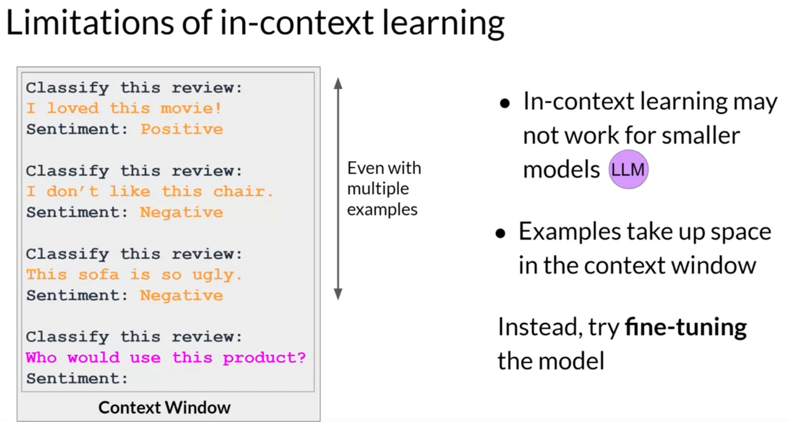
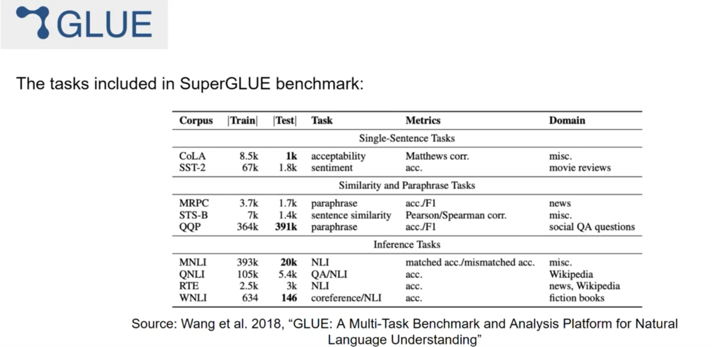
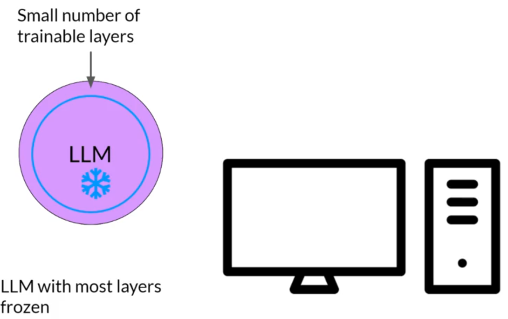
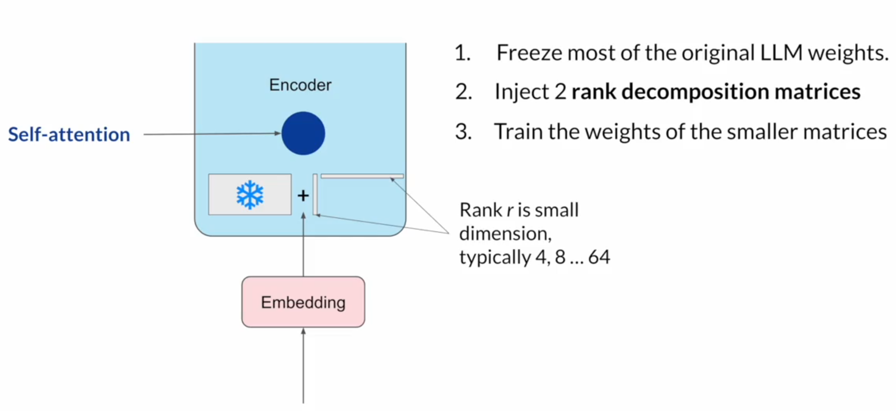
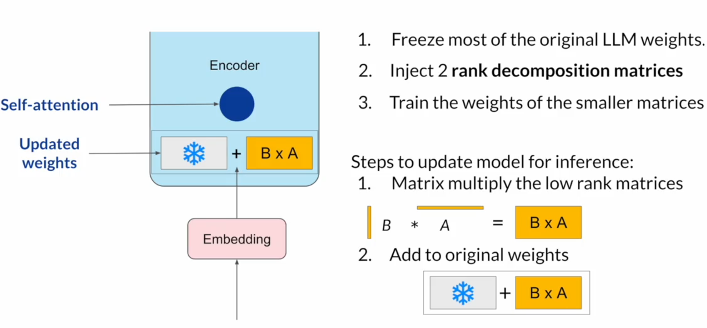
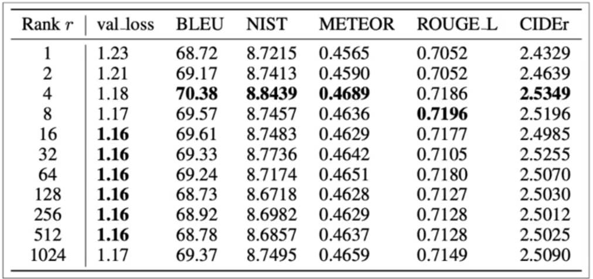

# Finetuning
## Instruction finetuning

In this lesson, you'll learn
- about methods that you can use to improve the performance of an existing model for your specific use case,
- about important metrics that can be used to evaluate the performance of your finetuned LLM,
- how to quantify its improvement over the base model you started with.

Let's start by discussing how to fine tune an LLM with instruction prompts. 

Some models are capable of identifying instructions contained in a prompt and correctly carrying out zero shot inference, while others, such as smaller LLMs, may fail to carry out the task, like the example shown here. Including one or more examples of what you want the model to do, known as one shot or few shot inference, can be enough to help the model identify the task and generate a good completion. However, this strategy has a couple of drawbacks. 

- First, for smaller models, it doesn't always work, even when five or six examples are included.
- Second, any examples you include in your prompt take up valuable space in the context window, reducing the amount of room you have to include other useful information.

Luckily, another solution exists, you can take advantage of a process known as **fine-tuning to further train a base model**. 

In contrast to pre-training, where you train the LLM using vast amounts of unstructured textual data via selfsupervised learning, fine-tuning is 
- a supervised learning process
- where you use a data set of labeled examples
- to update the weights of the LLM.

The labeled examples are prompt completion pairs. The **fine-tuning** process extends the training of the model to improve its ability to generate good completions **for a specific task**. 

Instruction fine-tuning trains the model using examples that demonstrate how it should respond to a specific instruction. Here are a couple of example prompts to demonstrate this idea. 

The instruction in both examples is classify this review, and the desired completion is a text string that starts with sentiment followed by either positive or negative. The data set you use for training includes many pairs of prompt completion examples for the task you're interested in, each of which includes an instruction. 

For example, if you want to fine tune your model to improve its summarization ability, you'd build up a data set of examples that begin with the instruction summarize, the following text or a similar phrase. And if you are improving the model's translation skills, your examples would include instructions like translate this sentence. 

These prompt completion examples allow the model to learn to generate responses that follow the given instructions.

Instruction fine-tuning, where all of the model's weights are updated is known as full fine-tuning. The process results in a new version of the model with updated weights. 

It is important to note that just like pre-training, full fine tuning requires enough memory and compute budget to store and process all the gradients, optimizers and other components that are being updated during training. You can benefit from the memory optimization and parallel computing strategies (quantization, pruning, ...). 

### How to do this in practice, instruction finetuning an LLM?

#### 1.  prepare your training data. 
There are many publicly available datasets that have been used to train earlier generations of language models, although most of them are not formatted as instructions. 

Therefore, developers have created **prompt template libraries** that can be used to take existing datasets - for example, the large data set of Amazon product reviews - and turn them into instruction prompt datasets for fine-tuning. 

Prompt template libraries include many templates for different tasks and different data sets. Here are three prompts that are designed to work with the Amazon reviews dataset and that can be used to fine tune models for classification, text generation and text summarization tasks. 

You can see that in each case
- you pass the original review, here called review_body, to the template,
- where it gets inserted into the text that starts with an instruction like
    - predict the associated rating,
    - generate a star review,
    - or give a short sentence describing the following product review.
The result is a prompt that now contains both an instruction and the example from the data set.

Once you have your instruction data set ready, as with standard supervised learning, you divide the data set into training validation and test splits.

During fine tuning, 
- you select prompts from your training data set and pass them to the LLM, which then generates completions.
- Next, you compare the LLM completion with the response specified in the training data.

In the example, the model didn't do a great job, it classified the review as neutral, which is a bit of an understatement. The review is clearly very positive.

Remember that the output of an LLM is a probability distribution across tokens. So you can compare the distribution of the completion and that of the training label and use the standard crossentropy function to calculate loss between the two token distributions. And then use the calculated loss to update your model weights in standard backpropagation.

You'll do this for many batches of prompt completion pairs and over several epochs, update the weights so that the model's performance on the task improves. 

As in standard supervised learning, you can define separate evaluation steps to measure your LLM performance using the holdout validation data set. This will give you the validation accuracy, and after you've completed your fine tuning, you can perform a final performance evaluation using the holdout test data set. This will give you the test accuracy. 

The fine-tuning process results in **a new version of the base model, often called an instruct model** that is better at the tasks you are interested in. Fine-tuning with instruction prompts is the most common way to fine-tune LLMs these days. From this point on, when you hear or see the term fine-tuning, you can assume that it always means instruction fine tuning.

## Finetuning on a single task.

LLMs are trained to perform many different tasks. Sometimes, your application only needs to perform one single task, like summarizing text. Then, you could finetune on that single task. Often just 500-1,000 examples can result in good performance in contrast to the billions of pieces of texts that the model saw during pre-training. 

However, there is a potential downside to fine-tuning on a single task. The process may lead to a phenomenon called **catastrophic forgetting**. 

Catastrophic forgetting happens because the full fine-tuning process modifies the weights of the original LLM. 

While this leads to great performance on the single fine-tuning task, it can degrade performance on other tasks. For example, while fine-tuning can improve the ability of a model to perform sentiment analysis on a review and result in a quality completion, the model may forget how to do other tasks.

This model knew how to carry out named entity recognition before fine-tuning correctly identifying Charlie as the name of the cat in the sentence. 

But after fine-tuning, the model can no longer carry out this task, confusing both the entity it is supposed to identify and exhibiting behavior related to the new task. 

What options do you have to avoid catastrophic forgetting? 

- First of all, it's important to decide whether catastrophic forgetting actually impacts your use case. If all you need is reliable performance on the single task you fine-tuned on, it may not be an issue that the model can't generalize to other tasks.
- If you do want or need the model to maintain its multitask generalized capabilities,
    -  you can perform fine-tuning on multiple tasks at one time. Good multitask fine-tuning may require 50-100,000 examples across many tasks, and so will require more data and compute to train.
    - A second option is to perform parameter efficient fine-tuning, or PEFT for short instead of full fine-tuning. PEFT is a set of techniques that preserves the weights of the original LLM and trains only a small number of task-specific adapter layers and parameters. PEFT shows greater robustness to catastrophic forgetting since most of the pre-trained weights are left unchanged.
 
## Multi-task instruction finetuning

Multitask fine-tuning is an extension of single task fine-tuning, where the training dataset is comprised of example inputs and outputs for multiple tasks. 

Here, the dataset contains examples that instruct the model to carry out a variety of tasks, including summarization, review rating, code translation, and entity recognition. 

You train the model on this mixed dataset so that it can improve the performance of the model on all the tasks simultaneously, thus avoiding the issue of catastrophic forgetting. 
Over many epochs of training, the calculated losses across examples are used to update the weights of the model, resulting in an instruction tuned model that is learned how to be good at many different tasks simultaneously. 

One drawback to multitask fine-tuning is that it requires a lot of data. You may need as many as 50-100,000 examples in your training set. However, it can be really worthwhile and worth the effort to assemble this data. The resulting models are often very capable and suitable for use in situations where good performance at many tasks is desirable. 

Let's take a look at one family of models that have been trained using multitask instruction fine-tuning. 

Instruct models differ based on the datasets and tasks used during fine-tuning. One example is the FLAN family of models. FLAN stands for fine-tuned language net, it is a specific set of instructions used to fine-tune different models.  

Example, 
- FLAN-T5, an instruct model, trained on the T5 foundation model,
- FLAN-PALM, an the instruct version of the palm foundation model.

FLAN-T5 is a great general purpose instruct model. In total, it's been fine tuned on 473 datasets across 146 task categories. Those datasets are chosen from other models and papers as shown here.

One example of a prompt dataset used for summarization tasks in FLAN-T5 is SAMSum. It is used to train language models to summarize dialogue. SAMSum is a dataset with 16,000 messenger-like conversations with summaries. Three examples are shown here with the dialogue on the left and the summaries on the right. 

The dialogues and summaries were crafted by linguists for the express purpose of generating a high-quality training dataset for language models. The linguists were asked to create conversations similar to those that they would write on a daily basis, reflecting their proportion of topics of their real life messenger conversations. 

Here is a prompt template designed to work with this SAMSum dialogue summary dataset. The template is actually comprised of several different instructions that all basically ask the model to do this same thing: summarize a dialogue. 

The **dialogue** from the SAMSum dataset is inserted into the template wherever the dialogue field appears. The **summary** is used as **the label**.

After applying this template to each row in the SAMSum dataset, you can use it to fine tune a dialogue summarization task.

While FLAN-T5 is a great general use model that shows good capability in many tasks. You may still find that it has room for improvement on tasks for your specific use case.

For example, imagine you're a data scientist building an app to support your customer service team, process requests received through a chat bot, like the one shown here. 

The SAMSum dataset gives FLAN-T5 some abilities to summarize conversations. However, the examples in the dataset are mostly conversations between friends about day-to-day activities and don't overlap much with the language structure observed in customer service chats. You can perform **additional fine-tuning** of the FLAN-T5 model using a dialogue dataset that is much closer to the conversations that happened with your bot.

One thing you need to think about when fine-tuning is how to evaluate the quality of your models completions. Next, you'll learn about several metrics and benchmarks that can be used to determine how well the model is performing and how much better the're fine-tuned version is than the original base model.

## Evaluation

### LLM evaluation - challenges

How can you formalize the improvement in performance of your fine-tuned model over the pre-trained model you started with? 

Let's explore several metrics that can be used to
- assess the performance a model,
- compare teh performance of a model to that of other models.

#### Performance in traditional machine learning

You can assess how well a model is doing by looking at its performance on training and validation data sets. In these datasets, the output is already known. 

Simple metrics can be calculated, such as accuracy:

This states the fraction of all predictions that are correct. It can be measured because **the models are deterministic**.

#### Performance in LLM

Witt large language models, **the output is non-deterministic**. Therefore, language-based evaluation is much more challenging. 

For example: 

The meaning of the sentences 'Mike really loves drinking tea' and 'Mike adores sipping tea' are quite similar. But how do you measure the similarity? 

Although there is only one word of difference between the sentences 'Mike does not drink coffee' and 'Mike does drink coffee', the meaning is completely different.

Humans can see the similarities and differences. But when you train a model on millions of sentences, you need an automated, structured way to make measurements. 

ROUGE and BLEU, are two widely used evaluation metrics for different tasks. 

ROUGE or Recall Oriented Understudy for Gisting Evaluation is primarily employed to assess the quality of automatically generated summaries by comparing them to human-generated reference summaries. 

BLEU, or Bilingual Evaluation Understudy is an algorithm designed to evaluate the quality of machine-translated text by comparing it to human-generated translations. 

##### Terminology:

In the anatomy of language, 
- a unigram is equivalent to a single word,
- a bigram is two words,
- an n-gram is a group of n-words.

##### ROUGE-1 metric.

ROUGE: Recall Oriented Understudy for Gisting Evaluation

Let's look at 
- a human-generated reference sentence 'It is cold outside' and
- a generated output 'It is very cold outside'.

You can perform simple metric calculations similar to other machine-learning tasks using recall, precision, and F1. 

- The recall metric measures the number of words or unigrams that are matched between the reference and the generated output divided by the number of words or unigrams in the reference. In this case, that gets a perfect score of one as all the generated words match words in the reference. 

- Precision measures the unigram matches divided by the output size.

- The F1 score is the harmonic mean of both of these values.

These are very basic metrics that only focused on individual words, hence the one in the name. They don't consider the ordering of the words. 

It can be deceptive. It's easily possible to generate sentences that score well but would be subjectively poor. 

Imagine that the sentence generated by the model was different by just one word,  'not'. The scores would be the same. 

You can get a slightly better score by taking into account bigrams or collections of two words at a time from the reference and generated sentence.

By working with pairs of words you're acknowledging in a very simple way, the ordering of the words in the sentence. By using bigrams, you're able to calculate a ROUGE-2. Now, you can calculate the recall, precision, and F1 score using bigram matches instead of individual words. You'll notice that the scores are lower than the ROUGE-1 scores. 

With longer sentences, they're a greater chance that bigrams don't match, and the scores may be even lower. Rather than continue on with ROUGE numbers growing bigger to n-grams of three or fours, let's take a different approach. 

Instead, you'll look for the longest common subsequence present in both the generated output and the reference output. 

In this case, the longest matching sub-sequences are, 'it is' and 'cold outside', each with a length of two. Use the LCS value to calculate the recall precision and F1 score, where the numerator in both the recall and precision calculations is the length of the longest common subsequence, in this case, two. 

Collectively, these three quantities are known as the Rouge-L score. 

As with all of the rouge scores, you need to take the values in context. You can only use the scores to compare the capabilities of models if the scores were determined for the same task. 

For example, summarization. Rouge scores for different tasks are not comparable to one another. 

As you've seen, a particular problem with simple rouge scores is that it's possible for a bad completion to result in a good score. Take, for example, this generated output, cold, cold, cold, cold. 

As this generated output contains one of the words from the reference sentence, it will score quite highly, even though the same word is repeated multiple times. The Rouge-1 precision score will be perfect. 

One way you can counter this issue is by using a **clipping function** to limit the number of unigram matches to the maximum count for that unigram within the reference. In this case, there is one appearance of cold and the reference and so a modified precision with a clip on the unigram matches results in a dramatically reduced score.

However, you'll still be challenged if their generated words are all present, but just in a different order. For example, with this generated sentence, 'outside cold it is'. This sentence was called perfectly even on the modified precision with the clipping function as all of the words and the generated output are present in the reference.

Whilst using a different rouge score can help, experimenting with a n-gram size that will calculate the most useful score will be dependent on 
- the sentence,
- the sentence size, and
- your use case.

Note that many language model libraries, for example, Hugging Face, include implementations of rouge score that you can use to easily evaluate the output of your model. 

##### BLEU metric.

BLEU: Bilingual Evaluation Understudy 

The BLEU score is useful for **evaluating the quality of machine-translated text**. 

The score itself is calculated using the **average precision over multiple n-gram sizes**. It is like the Rouge-1 score that we looked at before, but calculated for a range of n-gram sizes and then averaged. 

The BLEU score quantifies the quality of a translation by checking how many n-grams in the machine-generated translation match those in the reference translation. To calculate the score, you average precision across a range of different n-gram sizes. 

If you were to calculate this by hand, you would carry out multiple calculations and then average all of the results to find the BLEU score. 

Here is an example. The reference human-provided sentence is, 'I am very happy to say that I am drinking a warm cup of tea'. The results of BLEU using a standard library are shown.

As we get closer and closer to the original sentence, we get a score that is closer and closer to one. 

Both rouge and BLEU are quite simple metrics and are relatively low-cost to calculate. You can use them for simple reference as you iterate over your models, but you shouldn't use them alone to report the final evaluation of a large language model. Use rouge for diagnostic evaluation of summarization tasks and BLEU for translation tasks. For overall evaluation of your model's performance, however, you will need to look at one of the evaluation benchmarks that have been developed by researchers.

##### Benchmarks

LLMs are complex. Simple evaluation metrics like the rouge and bleu scores, can only tell you so much about the capabilities of your model. In order to measure and compare LLMs more holistically, you can make use of pre-existing datasets, and associated benchmarks that have been established by LLM researchers specifically for this purpose. 

Selecting the right evaluation dataset is vital, so that you can accurately assess an LLM's performance, and understand its true capabilities. 

You'll find it useful to select datasets that
- isolate specific model skills, like 
    - reasoning,
    - common sense knowledge,
- and those that focus on potential risks,
    - such as disinformation
    - or copyright infringement.

An important issue that you should consider is whether the model has seen your evaluation data during training. You'll get a more accurate and useful sense of the model's capabilities by evaluating its performance on data that it hasn't seen before. 

Benchmarks, such as GLUE, SuperGLUE, or Helm, cover a wide range of tasks and scenarios. They do this by designing or collecting datasets that test specific aspects of an LLM. 

**GLUE**

GLUE, or General Language Understanding Evaluation, was introduced in 2018. GLUE is a collection of natural language tasks, such as sentiment analysis and question-answering. 

GLUE was created to encourage the development of models that can generalize across multiple tasks, and you can use the benchmark to measure and compare the model performance. 

**SuperGLUE**
As a successor to GLUE, SuperGLUE was introduced in 2019, to address limitations in its predecessor. 

It consists of a series of tasks, some of which are not included in GLUE, and some of which are more challenging versions of the same tasks. SuperGLUE includes tasks such as multi-sentence reasoning, and reading comprehension. 

Both the GLUE and SuperGLUE benchmarks have leaderboards that can be used to compare and contrast evaluated models. The results page is another great resource for tracking the progress of LLMs.

ref. https://super.gluebenchmark.com/leaderboard/, https://gluebenchmark.com/leaderboard

As models get larger, their performance against benchmarks such as SuperGLUE start to match human ability on specific tasks. That's to say that models are able to perform as well as humans on the benchmarks tests, but subjectively we can see that they're not performing at human level at tasks in general. 

There is essentially an arms race between the emergent properties of LLMs, and the benchmarks that aim to measure them. Here are a couple of recent benchmarks that are pushing LLMs further. 

**MMLU**
Massive Multitask Language Understanding, or MMLU, is designed specifically for modern LLMs. 

To perform well models must possess extensive world knowledge and problem-solving ability. Models are tested on elementary mathematics, US history, computer science, law, and more. In other words, tasks that extend way beyond basic language understanding. 

**BIG-bench**
BIG-bench currently consists of 204 tasks, ranging through linguistics, childhood development, math, common sense reasoning, biology, physics, social bias, software development and more. 

BIG-bench comes in three different sizes, and part of the reason for this is to keep costs achievable, as running these large benchmarks can incur large inference costs. 

**HELM**
A final benchmark you should know about is the Holistic Evaluation of Language Models, or HELM.

The HELM framework aims to **improve the transparency of models**, and to offer guidance on which models perform well for specific tasks. 
HELM takes a multimetric approach, measuring seven metrics across 16 core scenarios, ensuring that trade-offs between models and metrics are clearly exposed.

One important feature of HELM is that it assesses on metrics beyond basic accuracy measures, like precision of the F1 score. 

The benchmark also **includes metrics for fairness, bias, and toxicity**, which are becoming increasingly important to assess as LLMs become more capable of human-like language generation, and in turn of exhibiting potentially harmful behavior. HELM is a living benchmark that aims to continuously evolve with the addition of new scenarios, metrics, and models. You can take a look at the results page to browse the LLMs that have been evaluated, and review scores that are pertinent to your project's needs.

ref. https://crfm.stanford.edu/helm/lite/latest/
    - 
## Parameter efficient finetuning

Training LLMs is computationally intensive. 

Full fine-tuning requires memory not just to store the model, but various other parameters that are required during the training process. Even if your computer can hold the model weights, which are now on the order of hundreds of gigabytes for the largest models, you must also be able to allocate memory for optimizer states, gradients, forward activations, and temporary memory throughout the training process. 

These additional components can be many times larger than the model and can quickly become too large to handle on consumer hardware. 

In contrast to **full fine-tuning** where **every model weight is updated during supervised learning**, **parameter efficient fine tuning methods only update a small subset of parameters**. 

Some PEFT techniques freeze most of the model weights and focus on fine tuning a subset of existing model parameters, for example, particular layers or components. 

Other techniques don't touch the original model weights at all, and instead add a small number of new parameters or layers and fine-tune only the new components. 

With PEFT, most if not all of the LLM weights are kept frozen. 

As a result, the number of trained parameters is much smaller than the number of parameters in the original LLM. In some cases, just 15-20% of the original LLM weights. 

This makes the memory requirements for training much more manageable. In fact, PEFT can often be performed on a single GPU. And because the original LLM is only slightly modified or left unchanged, **PEFT is less prone to the catastrophic forgetting problems of full fine-tuning**. 

Full fine-tuning results in a new version of the model for every task you train on. Each of these is the same size as the original model, so it can create an expensive storage problem if you're fine-tuning for multiple tasks.  

Let's see how you can use PEFT to improve the situation. With parameter efficient fine-tuning, you train only a small number of weights, which results in a much smaller footprint overall, as small as megabytes depending on the task. 

The new parameters are combined with the original LLM weights for inference. 

The PEFT weights are trained for each task and can be easily swapped out for inference, allowing efficient adaptation of the original model to multiple tasks. 

There are several methods you can use for parameter efficient fine-tuning, each with trade-offs on parameter efficiency, memory efficiency, training speed, model quality, and inference costs. 

Let's take a look at the three main classes of PEFT methods. 

**Selective methods** are those that fine-tune only a subset of the original LLM parameters. There are several approaches that you can take to identify which parameters you want to update. You have the option to train only certain components of the model or specific layers, or even individual parameter types. Researchers have found that the performance of these methods is mixed and there are significant trade-offs between parameter efficiency and compute efficiency We won't focus on them in this course.

**Reparameterization methods** also work with the original LLM parameters, but reduce the number of parameters to train by creating new low rank transformations of the original network weights. A commonly used technique of this type is LoRA.

**Additive methods** carry out fine-tuning by keeping all of the original LLM weights frozen and introducing new trainable components. 

Here there are two main approaches. 

- **Adapter methods** add new trainable layers to the architecture of the model, typically inside the encoder or decoder components after the attention or feed-forward layers.
- **Soft prompt methods**, on the other hand, keep the model architecture fixed and frozen, and focus on manipulating the input to achieve better performance. This can be done by adding trainable parameters to the prompt embeddings or keeping the input fixed and retraining the embedding weights. In this lesson, you'll take a look at a specific soft prompts technique called prompt tuning.

### Low-Rank Adaptation of Large Language Models (LoRA)

Low-rank Adaptation, or LoRA for short, is a parameter-efficient fine-tuning technique that falls into the re-parameterization category. 

Let's take a look at how it works. Here's a diagram of the transformer architecture. 

The input prompt is turned into tokens, which are then converted to embedding vectors and passed into the encoder and/or decoder parts of the transformer. 

In both of these components, there are two kinds of neural networks; 
- self-attention and
- feedforward networks.

The weights of these networks are learned during pre-training. 

After the embedding vectors are created, they're fed into the self-attention layers where a series of weights are applied to calculate the attention scores. During full fine-tuning, every parameter in these layers is updated. 

LoRA is a strategy that reduces the number of parameters to be trained during fine-tuning by 
- freezing all of the original model parameters and then
- injecting a pair of rank decomposition matrices alongside the original weights.
- 

The dimensions of the smaller matrices are set so that their product is a matrix with the same dimensions as the weights they're modifying. You then keep the original weights of the LLM frozen and train the smaller matrices using a supervised learning process. 

For inference, the two low-rank matrices are multiplied together to create a matrix with the same dimensions as the frozen weights. 

You then add this to the original weights and replace them in the model with these updated values. 

You now have a LoRA fine-tuned model that can carry out your specific task. Because this model has the same number of parameters as the original, there is little to no impact on inference latency*. 

* *Inference latency refers to the time it takes for an AI model to process input data and produce an output. It’s an important metric in AI applications, especially real-time systems, as it impacts responsiveness and user experience. Lower inference latency means faster results, which is crucial in fields like online services, gaming, and autonomous driving. Factors affecting inference latency include model size, computational resources, and optimization techniques used during deployment.*

Researchers have found that applying LoRA to just the self-attention layers of the model is often enough to fine-tune for a task and achieve performance gains. 

However, in principle, you can also use LoRA on other components like the feed-forward layers. But since most of the parameters of LLMs are in the attention layers, you get the biggest savings in trainable parameters by applying LoRA to these weights matrices. 

Let's look at a practical example using the transformer architecture described in the Attention is All You Need paper. 

The paper specifies that the transformer weights have dimensions of 512 by 64. This means that each weights matrix has 32,768 trainable parameters. 

If you use LoRA as a fine-tuning method with the rank equal to eight, you will instead train two small rank decomposition matrices whose small dimension is eight. This means that Matrix A will have dimensions of 8 by 64, resulting in 512 total parameters. Matrix B will have dimensions of 512 by 8, or 4,096 trainable parameters. 

By updating the weights of these new low-rank matrices instead of the original weights, you'll be training 4,608 parameters instead of 32,768 and 86% reduction. 

Because LoRA allows you to significantly reduce the number of trainable parameters, you can often perform this method of parameter efficient fine tuning with a single GPU and avoid the need for a distributed cluster of GPUs. 

Since the rank-decomposition matrices are small, you can fine-tune a different set for each task and then switch them out at inference time by updating the weights. 

Suppose you train a pair of LoRA matrices for a specific task; let's call it Task A. 

To carry out inference on this task, 
- you would multiply these matrices together and then
- add the resulting matrix to the original frozen weights.
- You then take this new summed weights matrix and replace the original weights where they appear in your model.
- You can then use this model to carry out inference on Task A.

If instead, you want to carry out a different task, say Task B, you simply take the LoRA matrices you trained for this task, calculate their product, and then add this matrix to the original weights and update the model again. 

The memory required to store these LoRA matrices is very small. So in principle, you can use LoRA to train for many tasks. Switch out the weights when you need to use them, and avoid having to store multiple full-size versions of the LLM.

### Lora - evaluation

How good are these models? Let's use the ROUGE metric to compare the performance of a LoRA fine-tune model to both an original base model and a full fine-tuned version. As an example, let's focus on fine-tuning the FLAN-T5 for dialogue summarization. 

The FLAN-T5-base model has had an initial set of full fine-tuning carried out using a large instruction data set. First, let's set a baseline score for the FLAN-T5 base model and the summarization data set we discussed earlier. Here are the ROUGE scores for the base model where a higher number indicates better performance. 

You should focus on the ROUGE 1 score for this discussion, but you could use any of these scores for comparison. As you can see, the scores are fairly low. 

Next, look at the scores for a model that has had additional full fine-tuning on dialogue summarization. Remember, although FLAN-T5 is a capable model, it can still benefit from additional fine-tuning on specific tasks. 

With full fine-tuning, you update every weight in the model during supervised learning. You can see that this results in a much higher ROUGE 1 score increasing over the base FLAN-T5 model by 80%. The additional round of fine-tuning has greatly improved the performance of the model on the summarization task. 

Now let's take a look at the scores for the LoRA fine-tuned model. You can see that this process also resulted in a big boost in performance. The ROUGE 1 score has increased from the baseline by 75%. This is a little lower than full fine-tuning, but not much. 

However, using LoRA for fine-tuning trained a much smaller number of parameters than full fine-tuning using significantly less compute, so this small trade-off in performance may well be worth it. 

### LoRa - choose the rank of the LoRa matrices
You might be wondering how to choose the rank of the LoRA matrices. This is still an active area of research. 

In principle, the smaller the rank, the smaller the number of trainable parameters, and the bigger the savings on compute. 

However, there are some issues related to model performance to consider. 

In the paper that first proposed LoRA, researchers at Microsoft explored how different choices of rank impacted the model performance on language generation tasks. You can see the summary of the results in the table here. 

The table shows
- the rank of the LoRA matrices in the first column,
- the final loss value of the model, 
- the scores for different metrics, including BLEU and ROUGE.

The bold values indicate the best scores that were achieved for each metric. The authors found a plateau in the loss value for ranks greater than 16. In other words, using larger LoRA matrices didn't improve performance. 

The takeaway here is that ranks in the range of 4-32 can provide you with a good trade-off between reducing trainable parameters and preserving performance. 

Optimizing the choice of rank is an ongoing area of research and best practices may evolve as more practitioners make use of LoRA. 

LoRA is a powerful fine-tuning method that achieves great performance. The principles behind the method are useful not just for training LLMs, but also for models in other domains.

## Prompt tuning

With LoRA, the goal was to find an efficient way to update the weights of the model without having to train every single parameter again. 

There are also additive methods within PEFT that aim to improve model performance without changing the weights at all. In this section, you'll explore a second parameter efficient fine tuning method called **prompt tuning**. 

Prompt tuning sounds a bit like prompt engineering, but they are quite different from each other. 

With **prompt engineering**, you work on the language of your prompt to get the completion you want. This could be as simple as trying different words or phrases or more complex, like including examples for one or Few-shot Inference. The goal is to help the model understand the nature of the task you're asking it to carry out and to generate a better completion. 

However, there are some limitations to prompt engineering, 
- as it can require a lot of manual effort to write and try different prompts,
- you're also limited by the length of the context window,
- and at the end of the day, you may still not achieve the performance you need for your task.

With **prompt tuning**, you **add additional trainable tokens to your prompt** and leave it up to the supervised learning process to determine their optimal values. 

The **set of trainable tokens** is called a **soft prompt**, and it gets prepended to embedding vectors that represent your input text.

The soft prompt vectors have the same length as the embedding vectors of the language tokens. 

Including somewhere between 20 and 100 virtual tokens can be sufficient for good performance.

The tokens that represent natural language are 'hard' in the sense that they each correspond to a fixed location in the embedding vector space. 

However, the soft prompts are not fixed discrete words of natural language. Instead, you can think of them as virtual tokens that can take on any value within the continuous multidimensional embedding space. 

Through supervised learning, the model learns the values for these virtual tokens that maximize performance for a given task. 

In full fine tuning, the training data set consists of input prompts and output completions or labels. The weights of the large language model are updated during supervised learning. 

In contrast with prompt tuning, the weights of the large language model are frozen and the underlying model does not get updated. Instead, the embedding vectors of the soft prompt gets updated over time to optimize the model's completion of the prompt. 

Prompt tuning is a very parameter efficient strategy because only a few parameters are being trained. In contrast with the millions to billions of parameters in full fine tuning.

Similar to what you saw with LoRA, you can train a different set of soft prompts for each task and then easily swap them out at inference time. 

You can train a set of soft prompts for one task and a different set for another. To use them for inference, you prepend your input prompt with the learned tokens to switch to another task, you simply change the soft prompt. 

Soft prompts are very small on disk, so this kind of fine tuning is extremely efficient and flexible.

You'll notice the same LLM is used for all tasks, all you have to do is switch out the soft prompts at inference time. 

### Soft prompt - evaluation

So how well does prompt tuning perform? In the original paper, (...), the authors compared prompt tuning to several other methods for a range of model sizes.

In this figure from the paper, you can see the Model size on the X axis and the SuperGLUE score on the Y axis. This is the evaluation benchmark that grades model performance on a number of different language tasks. 

- The red line shows the scores for models that were created through full fine tuning on a single task. 
- The orange line shows the score for models created using multitask fine tuning.
- The green line shows the performance of prompt tuning and finally.
- The blue line shows scores for prompt engineering only.

Prompt tuning doesn't perform as well as full fine tuning for smaller LLMs. 

However, as the model size increases, so does the performance of prompt tuning. Once models have around 10 billion parameters, prompt tuning can be as effective as full fine tuning and offers a significant boost in performance over prompt engineering alone. 

One potential issue to consider is the interpretability of learned virtual tokens. 

Because the soft prompt tokens can take any value within the continuous embedding vector space, the trained tokens don't correspond to any known token, word, or phrase in the vocabulary of the LLM. 

However, an analysis of the nearest neighbor tokens to the soft prompt location shows that they form tight semantic clusters. 

In other words, the words closest to the soft prompt tokens have similar meanings. The words identified usually have some meaning related to the task, suggesting that the prompts are learning word like representations. 

## PEFT methods summary

You explored two PEFT methods in this lesson. 
- LoRA, which uses rank decomposition matrices to update the model parameters in an efficient way.
- Prompt Tuning, where trainable tokens are added to your prompt and the model weights are left untouched.

Both methods enable you to fine tune models with the potential for improved performance on your tasks while using much less compute than full fine tuning methods.

LoRA is broadly used in practice because of the comparable performance to full fine tuning for many tasks and data sets

## Finetuning summary

- You've seen how to adapt a foundation model through a process called instruction fine-tuning.
- You saw some of the prompt templates and data sets that were used to train the FLAN-T5 model.
- You also saw how to use evaluation metrics and benchmarks such as ROUGE and HELM to measure success during model finetuning.

In practice instruction finetuning has proven very effective and useful across a wide range of natural language use cases and tasks. With just a few hundred examples, you can fine tune a model to your specific task. 

- You saw how parameter efficient fine tuning, or PEFT, can reduce the amount of compute required to finetune a model.
- You learned about two methods you can use for this: LoRA and Prompt Tuning.

You can also combine LoRA with the quantization techniquesto further reduce your memory footprint. This is known as QLoRA.

In practice, PEFT is used heavily to minimize compute and memory resources. And ultimately reducing the cost of fine tuning, allowing you to make the most of your compute budget and speed up your development process.

## Getting started: Documentation and notebook
https://huggingface.co/docs/peft/main/en/quicktour
https://huggingface.co/docs/peft/main/en/task_guides/lora_based_methods

