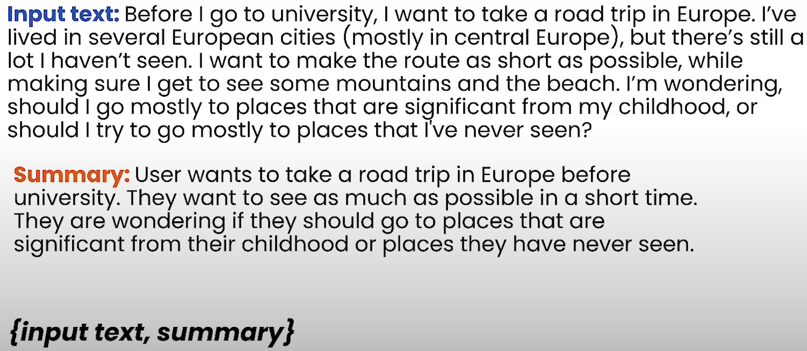
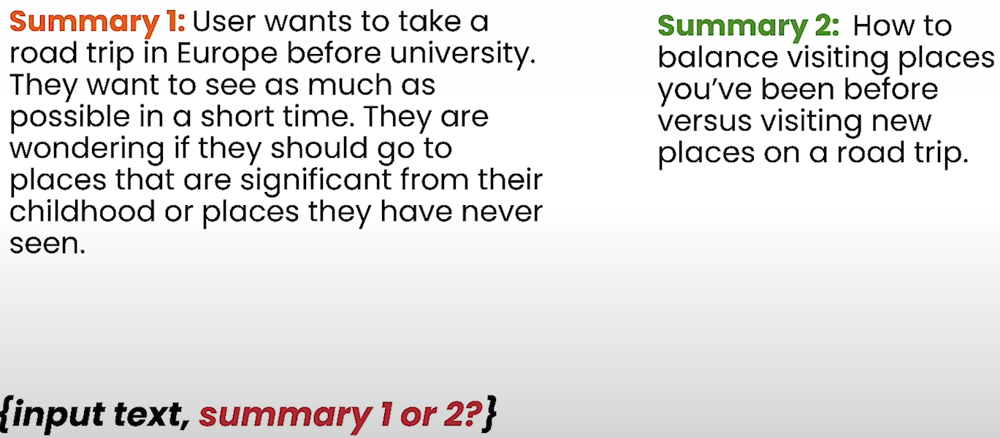
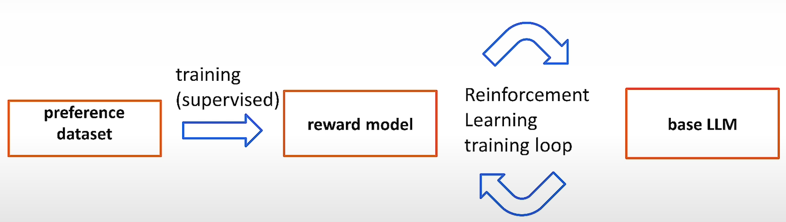
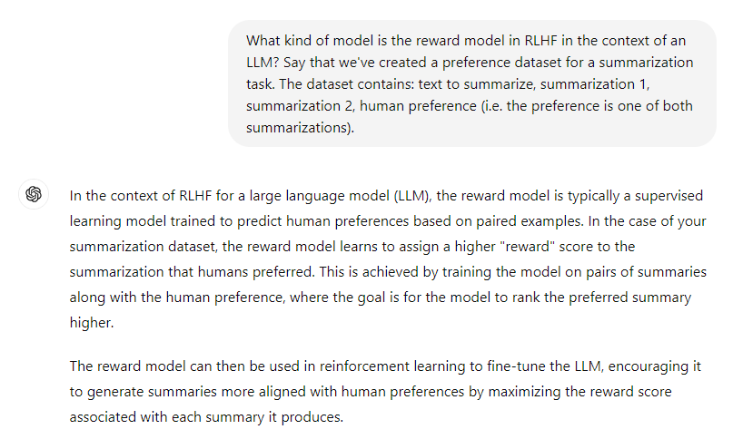
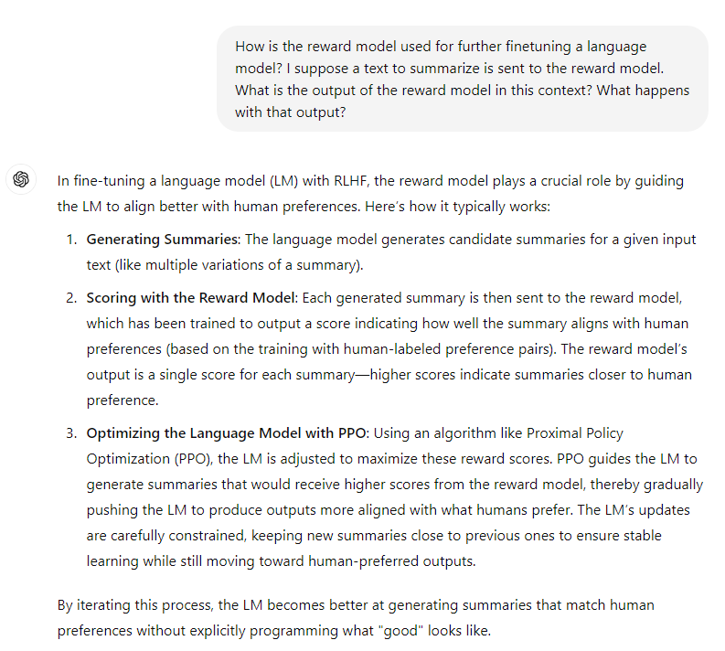
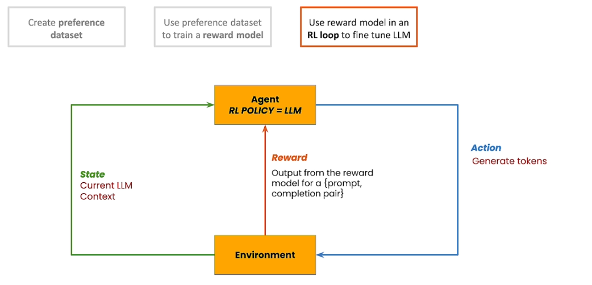
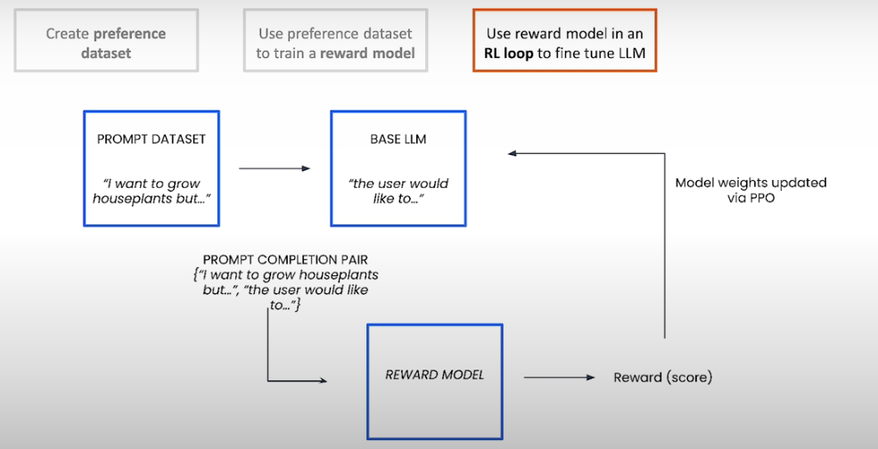

# Reïnforcement learning with human feedback (RLHF)

## Introduction

LLMs are trained on a large amount of data from the internet. It contains alls sorts of information.
Thus, it can generate results that are harmful, false or unhelpful.

RLHF is an important tuning technique that has been crititcal to align an LLM's output with human preferences and values.

It can be useful, even if you are not training an LLM from scratch. You can tune it to the behaviour you want to set.

For example, there are many valid ways in which an LLM can respond to questions as "What is the capital of France?"
It could reply with "Paris is the capital of France" or it could even more simply reply: "Paris". Some of these responses will feel more natural than others.

RLHF is a technique we can use to better algin an LLM with user intention and preference.

RLHF is usefull when you want to train a model to learn how to solve a task that involves a complex and fairly open-ended objective. You may not know what the optimal solution is, but you can give the model rewards to guide the tours and optimal series of steps.

## RLHF explained

Let's say, we want to tune a model on a summarization task. Start by gathering some samples to summarize, and have humans produce a summary for each input.

There is no one correct way to summarize a piece of text. Different people, will all have a different preference. Preferences are hard to quantify.

Depending on the task you want to do, one answer can be prefered over another.

Compare:
- Supervised fine tuning: {input_text, summary}
- RLHF: {input text, summary 1, summary 2, human preference}

RLHF consists of 3 stages:
- first, create a preference dataset,
- use it to train a reward model with supervised learning,
- use the reward model to finetune our base LLM.

### 1. Create a preference dataset

Get the model to generate multiple completions for the same prompt.

First you would think to let human labelers give a number (score) on how good an answer is.
This is not a good practice, because scales like this are subjective, they tend to vary accross people.

Instead you let the human labeler compare 2 different output completions for the same input prompt and specify which one they prefer.

This is the preference dataset: it indicates a labelers preference between two model outputs for the same input.

This captures the preference of the labelers, not human preference in general. Creating a preference dataset is tricky.

First you need to define your alignment criteria: 
- What are you trying to achieve by tuning?
- Do you want the model to behave more usefull, less toxic, etc.

You need to be clear about this, so you can provide specific instructions and choose the correct labelers.

### 2. Use the preference dataset to train a reward model.
   
Use the dataset to train a reward model. We want the model to input a prompt and completion, and return a scalar value indicating how good the completion is for the given prompt. The reward model is essentially a regression model, it outputs numbers. It is trained on a preference dataset, incorporating the prompt and 2 candidates: the winning and the loosing candidate.

Here's how chatGPT explains it:

### 3. Use the reward model to generate a score and to finetune the base LLM.

Introduce a second dataset: a prompt dataset. This is a dataset of prompts, no completion.

Feed these prompts to the LLM and have it generate candidate completions. For each candidate completion, we get the reward model to produce a score. 

The loss function is a combination of these scores. Intuïtively you can think about this as trying to maximize the differnce in scores between the winning candidate and the losing candidate.

The measure about how good a completion is, is subjective. But you can think of this as the higher the number, the better this completion aligns with the preference of the people who labeled the data.

Use the reward model in an RL loop to fine tune LLM.

Here's how chatGPT explains it:

### 4. Theoretical approach

When approaching RLHF somewhat more theoretically, we get:

- An agent (LLM) learns to solve a task by interacting with an environment (environment: here, the reward model). 
- This agent (LLM) performs actions on the environment (action: the LLM generates tokens).
- As a result, it changes the state of the environment and recieves a reward that helps it to learn the rules of the environment. By repeating this cycle, the model learns.

It differs from supervised learning, because there is no supervision. The agent learns by interacting with the environment, exploring a list of actions and then adjusting it's path.

The agents learn understanding of how rewarding each possible action is, given the current conditions. What it has learned, is saved in a the "policy" (the LLM).

Thus, in this scenario, 
- The policy is the base LLM that we want to tune.
- The current state is whatever is in de context. A prompt, a generated text up until this point.
- Actions are generating tokens. Each time an LLM generates a completion, it recieves a reward from the reward model, indicating how aligned that generated text is.
- Learning the policy that maximizes the reward leads to a LM that produces completions that high score from the reward model.

For LLMs, the method Proximal Policy Optimization is used (a standard RL algorithm).

A prompt is sampled from a prompt dataset, it is fed to the base model to produce a completion, the prompt-completion pair is passed to the reward model to produce a score or a reward.
The weight of the base LLM, also known as the policy, are updated via PPO using the reward. Each time we update the weight, the policy should get a little better at outputting the text.

