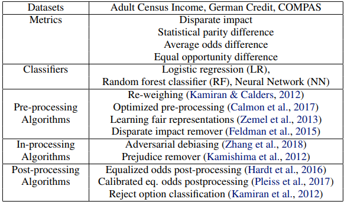

# Bias and fairness

Machine learning models are increasingly used to inform high stakes decisions about people. Although machine learning, by its very nature, is always a form of statistical discrimination, the discrimination becomes objectionable when it places certain privileged groups at systematic advantage and certain unprivileged groups at systematic disadvantage. Biases in training data, due to either prejudice in labels or under-/over-sampling, yields models with unwanted bias.

## 1. What is fairness

**Fairness can be defined as the absence of any prejudice or favoritism towards an individual or a group of individuals based on their inherent acquired characteristics such as race, gender, religion, etc.**

There are numerous examples of AI applications that exhibited unwanted discriminatory behaviors.

Fairness is one of the main requirements in which many AI systems fail. 

There is a high need to take action to overcome the potential bias that might be embedded in AI systems.

An AI trained on biased data, will inherit the bias.
Steps should be taken to make sure:
- the AI does not perpetuate unfair biases,
- the AI does not introduce new biases.

## 2. Examples of biased AI systems

### 2.1 The Compas Software

One of the most prominent examples is the Correctional Offender Management Profiling for Alternative Sanctions (Compas) system. 

It is a software used in the US to assess the recidivism risk of defendants. Julia Angwin investigated the software and showed that 
- compared to white defendants, black defendants are predicted as twice as likely to re-offend although they do no subsequent offenses,
- while white defendants with subsequent offenses are predicted as low risk compared to their black counterparts.

In other words, the software had a higher **false positive rate** for black defendants and a **higher false negative rate** for white defendants.

### 2.2 Amazon gender bias hiring system¶

Another example is the AI-based hiring system used by Amazon for assessing the resumes of job applicants. It was observed that the evaluations assigned to applicants’ resumes exhibited gender bias. Women received lower scores for technical positions compared to the male applicants. 

In fact, due to the underrepresentation of women in technical job positions, the software inherently linked male applicants to higher scores. 

Although gender information was not explicitly used in the resumes, the system was able to infer it via women’s related information in the resume, such as *women’s chess club captain* or attendance to all women’s colleges.

### 2.3 Google Translate gender bias¶

Gender bias in machine translation was shown when translating text between gender-neutral languages such as Turkish and other languages such as English and French. 

When translating a sentence, it is observed that the system often assigns male pronouns (he, him) to terms like Doctor and Software. In contrast, female pronouns are predominantly assigned to words like Nurse or Hometaker.

Exercise: Ask a language model "The doctor and the nurse where fighting, because she was late. Who was late?"

### 2.4 Bias in the facial recognition system

Face recognition algorithms claim to achieve high classification accuracy, surpassing 90%. However, these results do not apply uniformly. A growing body of research reveals significant variations in error rates among different demographic groups, particularly in the accuracy of 

- female individuals,
- Black individuals,
- and those aged 18-30.

In a significant project called "Gender Shades" , researchers employed an intersectional approach to evaluate gender classification algorithms, including those developed by IBM and Microsoft. Participants were categorized into four groups: darker-skinned females, darker-skinned males, lighter-skinned females, and lighter-skinned males. 

Remarkably, all (three) algorithms performed the poorest in identifying darker-skinned females, with error rates up to 34% higher than lighter-skinned males. These findings have been further supported by the National Institute of Standards and Technology (NIST), which independently assessed 189 face recognition algorithms and confirmed that the technologies are least accurate when identifying women of color.

## 3. Consequences

These non-exhaustive examples of AI bias have triggered the need for developing more inclusive AI models in order to make their use more socially acceptable.

A biased AI system does not only have a negative impact on the end-users but can the organization deploying the system can suffer reputation damage, users distrust, and juridical liability. 

Initial important steps to mitigate these issues focused on mathematically defining and quantifying bias AI systems.

## 4. Measuring fairness
Assessing fairness is situation-specific: keep in mind the purpose of the specific decision-making process the AI will serve.

### 4.1 Individual vs. Group Fairness, or Both

- **Group fairness**, in its broadest sense, partitions a population into groups defined by protected attributes and seeks for some statistical measure to be equal across groups.

Some common protected attributes are: gender, race, ...

- **Individual fairness**, in its broadest sense, seeks for similar individuals to be treated similarly.

### 4.2 Group Fairness: Data vs. Model

Fairness can be measured at different points in a machine learning pipeline: 
- either on the training data (pre-processing),
- during training (in-processing),
- on the learned model (post-processing).

### 4.3 Data bias

Remark: 4.3 data bias, 4.4 demographic / statistical parity, 4.5 dispate impact are strongly related.

The first step is the data bias check, which is a comparison of the distributions of sensitive variables between the target and the whole dataset.

Example of intervention: collecting more data to find evidence of unfair bias.

When checking a sensitive variable (e.g. gender), we compare 
- its volume wrt the total volume (eg do males and females follow the popluation distribution?, If not, is there a plausible reason?)
- to the volume in the target only (e.g., is it the same proportion as in total? If not, is there an explanation for the difference?)

ref. notebooks/data_bias.ipynb

Potential actions when data bias is detected:
- Analyse the data on possible data quality issues.
- Try to remove bias by pre-processing the data:
    - remove the variables linked to the sensitive variable from the model,
    - rebalance the training data so that the penetration of the target variable is the same for the different levels of the sensisitve variable.

### 4.4 Demographic parity (aka statistic parity, group fairness, acceptence rate and benchmarking)

The protected subject (or sensitive variable) is the subject for which you want to examine bias. 
For example, let the protected subject be 'gender'. 

We strive for demographic parity or statistical parity. It means:

- The (gender) groups should have an equal probability of being selected by the model.
or
- The (gender) groups should have an equal probability of being assigned to the positive predicted class.

Eg. Men and women should have equal probability to have a good predicted credit score.

We measure **"statistical parity difference"** by the following formula:

**Pr(Y=1|D=unprivileged)−Pr(Y=1|D=privileged)**

ref. notebooks/statistical_parity.ipynb

Here the bias or statistical imparity is the difference between the probability that a random individual drawn from unprivileged is labeled 1 (so here has a good credit score) and the probability that a random individual from privileged is labeled 1.

So, the statistical imparity has to be close to 0 so it will be fair.

An interesting article:
https://www.jeremykun.com/2015/10/19/one-definition-of-algorithmic-fairness-statistical-parity/

### 4.5 disparate impact
For this metric we use the following formula :

**Pr(Y=1|D=unprivileged) / Pr(Y=1|D=privileged)**

Like the first metric we use both probabities of a random individual drawn from unprivileged or privileged with a label of 1 but here it's a ratio.

This metric is closely related to the previous one. Only, it calculates a ratio instead of a difference.
It changes the objective, we strive for a disparate impact close to 1.

### 4.6 Equalized odds (aka conditional procedure accuracy equality and diparate mistreatment)
Groups have both equal TPR (mathematically equivalent to FNR) and equal FPR (mathematically equivalent to TNR)
The groups should have equal precision and equal recall.

For example, 
- the probability of an applicant with an actual good credit score to be correctly assigned a good predicted credit score (TPR) and
- the probaility of an applicant with an actual bad credit score to be incorrectly assigned a good prediced credit score is the same (FPR).

In the model predictions, the groups should have similar false prediction rates.
Differently said, groups should have equal false positive rate and equal false negative rate.

Example of intervention: select the threshold (ROC) for each group independently so as to match the TPR and FPR.

Formulas:
TPR = sensitivity = recall = TP / (TP + FN)
TPR: Of all observations for which the target is 'positive' (1), how many are predicted by the model to be positive (1)?

TNR = specificity = TN / (TN + FP)
TNR: Of all observation for which the target is 'negative' (0), how many are predicted by the model to be negative (0)?

## 5. Algorithms to mitigate bias

Bias mitigation algorithms attempt to improve the fairness metrics by modifying 
- the training data,
- the learning algorithm,
- or the predictions.

These algorithm categories are known as pre-processing, in-processing, and post-processing, respectively.

ref. 4.1 Pre-processing Bias Mitigation Methods, 4. Algorithms in https://dl.acm.org/doi/full/10.1145/3631326

Here are some examples:

### 5.1 pre-processing methods 
#### 5.1.1 pre-processing method: labeling and perturbation

These mitigation methods that apply changes to the values of the training data. Changes have been applied 
- to the ground truth labels (relabeling) or
- to the remaining features (perturbation).

##### 5.1.1.1 relabeling methode: massaging
An example of a relabling method is "massaging".

In the first stage, “massaging” uses a ranker to determine the best candidates for relabeling. In particular, instances close to the decision boundary are selected to minimize the negative impact of relabeling on accuracy. Typically, an equal amount of instances with positive and negative labels are selected, according to their rank and their labels are switched.

##### 5.1.1.2 relabeling methode: based on k-nearest neighbors
Another relabeling approach relabels instances based on their k-nearest neighbors, such that similar individuals receive similar labels.

#### 5.1.2 pre-processing method: sampling

Sampling methods change the training data by changing the distribution of samples (e.g., adding, removing samples) or adapting their impact on training. Similarly, the impact of training data instances can be adjusted by reweighing their importance.

##### 5.1.2.1 sampling method: reweighing
When using "Reweighing", each instance receives a weight according to its label and protected attribute (e.g., instances in the unprivileged group and positive label receive a higher weight, as this is less likely). In the training process of classification models, a higher instance weight causes higher losses when misclassified. 

##### 5.1.2.2 sampling method: downsampling / upsampling
Other sampling strategies include the removal of data points (downsampling)  or the addition of new data points (upsampling). Popular methods for upsamplig are oversampling for duplicating instances of the minority group  and the use of SMOTE . SMOTE does not duplicate instances but generates synthetic ones in the neighborhood of the minority group

#### 5.1.3 pre-processing method: latent variables
Latent variables describe the augmentation of training data with additional features that are preferably unbiased.

### 5.2 in-processing methods
#### 5.2.1 in-processing method: regularization and constraints

Regularization and constraints are both approaches that apply changes to the learning algorithm’s loss function. Regularization adds a term to the loss function. While the original loss function is based on accuracy metrics, the purpose of a regularization term is to penalize discrimination (i.e., discrimination leads to a higher loss of the ML algorithm). Constraints, however, determine specific bias levels (according to loss functions) that cannot be breached during training.

#### 5.2.2 in-processing method: adversarial learning

Adversarial learning simultaneously trains classification models and their adversaries [92]. While the classification model is trained to predict ground truth values, the adversary is trained to exploit fairness issues. Both models then compete against each other to improve their performance.

#### 5.2.3 in-processing method: compositional

Compositional approaches combat bias by training multiple classification models. Predictions can then be made by a specific classification model for each population group (e.g., privileged and unprivileged)  or in an ensemble fashion (i.e., a voting of multiple classification models at the same time) 

## 5.3 post-processing methods

Post-processing bias mitigation methods are applied once a classification model has been successfully trained. These methods seem to be less applied.

### 5.3.1 post-processing method: input correction
Input correction approaches apply a modification step to the testing data. This is comparable to pre-processing approaches, which conduct modifications to training data (e.g., relabeling, perturbation, and representation learning).

### 5.3.2 post-processing method: output correction
The latest stage of applying bias mitigation methods is the correction of the output. In particular, the predicted labels are modified.

### 5.3.3 probably a post-processing method:
"Train Then Mask", ref. https://arxiv.org/abs/1811.04973

## 6. tools
### 6.1 AIF360
The AI Fairness 360 Python package includes 
- a comprehensive set of metrics for datasets and models to test for biases,
- explanations for these metrics,
- and algorithms to mitigate bias in datasets and models.

ref. 
- https://aif360.res.ibm.com/resources#guidance,
- https://arxiv.org/abs/1810.01943 (6. Metrics class)

### 6.2 Fairlearn
https://pypi.org/project/fairlearn/

### 6.3 Fairlib
https://pypi.org/project/fairlib/

## 7. Calculation methods
In order to get some mathematical understanding of how to calculate bias, I think the following page can help:

ref. https://github.com/Trusted-AI/AIF360/blob/main/aif360/metrics/classification_metric.py
